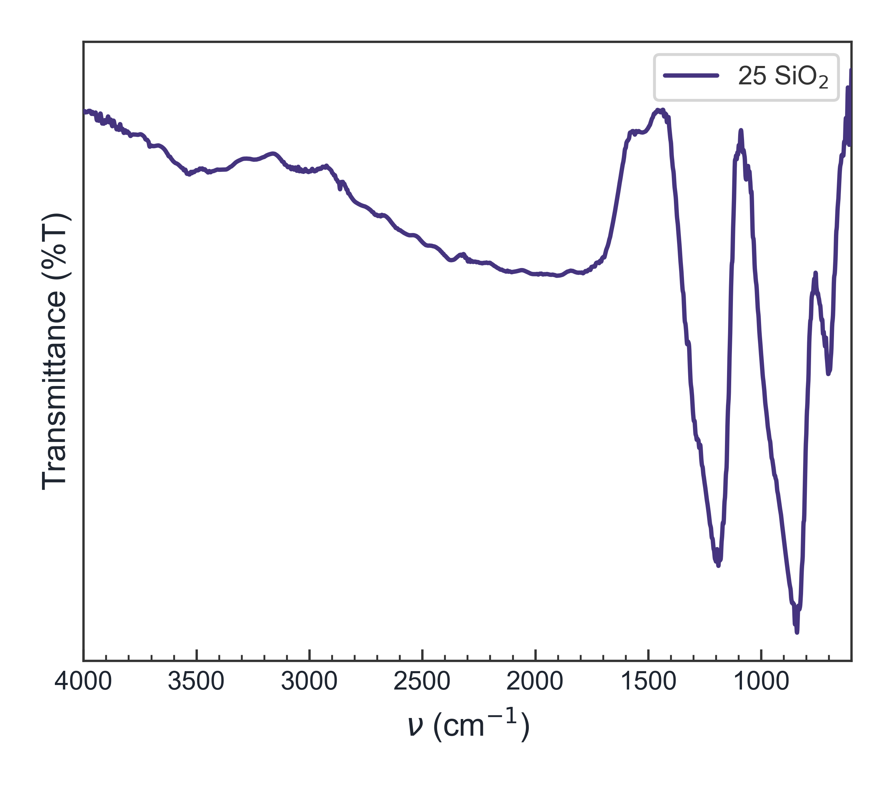
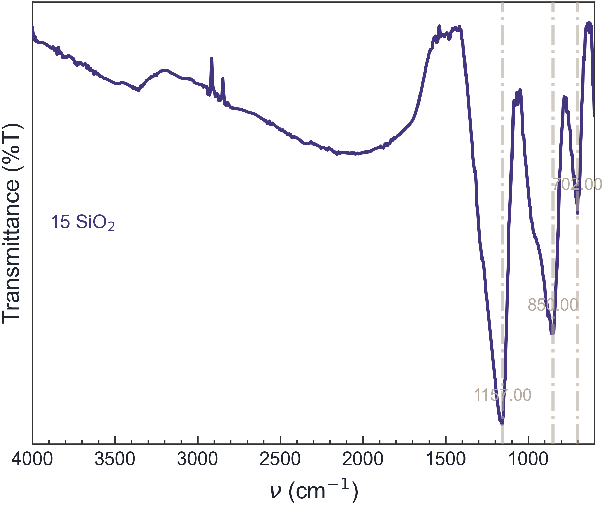
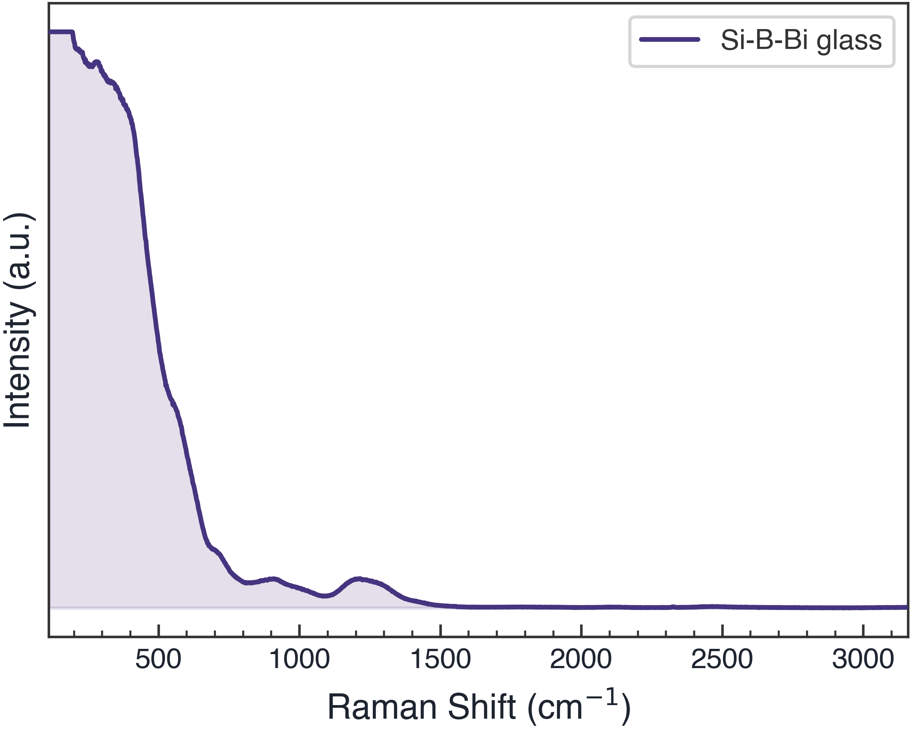

## Where does FTIR and Raman data processing usually get stuck?

The instrument file is rarely the hardest part. The time goes into the follow-up work: different file formats, a drifting baseline, noisy curves, inconsistent axis directions, overlapping samples, and figure formatting that does not match the rest of a manuscript.

Excel or a general plotting application may be enough for one curve. But when you need to compare ten samples, use consistent colors and offsets, mark candidate peaks, or make FTIR, Raman, XRD and UV-Vis figures look like they belong in the same paper, a focused spectroscopy workflow saves time.

**Spectra Studio** is a Windows desktop application for loading and organizing XRD, FTIR, Raman, UV-Vis and DSC/TGA data.

## Which FTIR and Raman formats are supported?

Common inputs include:

- **FTIR**: `.asc`
- **Raman**: `.txt`, `.xy` and `.csv`
- **Generic spectra**: two-column text or CSV files

If an FTIR wavenumber axis is exported in the opposite direction, the application can automatically correct the direction for display. Before loading, still confirm that the first column is the wavenumber or Raman shift and that the second column is the corresponding absorbance or intensity signal.

## A practical FTIR and Raman processing workflow

### Step 1: Load several samples together

Load the files from one experiment into the sample list. For comparison, choose the display mode that matches the question:

- **Overlay**: useful for peak shifts and shape comparison;
- **Stack**: keeps each spectrum visually separated;
- **Vertical offset**: controls spacing between curves;
- **Normalize**: compares relative shape rather than absolute signal level;
- **Batch colors**: assigns consistent colors to sample groups.

This is less error-prone than copying each curve into Excel, manually entering offsets and changing colors one at a time.

### Step 2: Check the axis and data direction

FTIR is commonly shown as wavenumber in cm⁻¹, while Raman is commonly shown as Raman shift in cm⁻¹. The unit may look the same, but the physical meaning and measurement conditions are different, so label the axes explicitly.

Some FTIR figures run from high to low wavenumber. When multiple files are overlaid, make sure every file uses a consistent direction. Spectra Studio helps correct the FTIR axis direction, but the final axis range and labels should still be checked before export.

### Step 3: Apply smoothing and baseline correction conservatively

Savitzky–Golay smoothing can reduce high-frequency noise while preserving peak shape. ALS baseline correction can help with a sloping or drifting background. Set the parameters according to the sampling interval, peak width and signal-to-noise ratio.

Use both operations carefully. An overly large smoothing window can weaken a narrow band, while an aggressive baseline can remove a real broad feature. Keep the original curve and record the processing settings for the methods section.

### Step 4: Detect candidate peaks

Automatic peak detection is helpful when you have many samples or broadly known peak regions. The detector uses height and shape to identify candidates; adjust the sensitivity and review the marks on the plot.

Automatic detection is a starting point, not a complete chemical assignment. Functional-group or vibrational-mode interpretation still requires the material, literature, reference samples and experimental context. Spectra Studio accelerates figure preparation and peak measurement; it does not replace spectroscopy judgment.

### Step 5: Fit overlapping peaks when numbers are needed

Pro supports Gaussian, Lorentzian and mixed-profile fitting for overlapping features. The results include peak position, FWHM, area, R² and residuals, which can help compare treatment-induced changes in peak width or relative area.

Use a justified model rather than adding components simply to reduce the residual. For a formal report, preserve the raw data, fitted curves and residuals, and record the profile and baseline settings.

### Step 6: Apply a consistent publication style

Nature, ACS and Elsevier starting styles provide a common basis for fonts, lines and axes. You can tune:

- legend position;
- font and font size;
- line width and color;
- tick direction and length;
- axis range and title;
- sample labels for overlay or stacked curves.

When XRD, FTIR, Raman and UV-Vis figures appear in the same paper, consistent layout rules make it easier for readers to move between panels.

## Free and Pro features

The Free edition supports a complete basic FTIR and Raman plotting workflow:

- multiple-format loading;
- overlay, stack, normalization and vertical offsets;
- Savitzky–Golay smoothing;
- ALS baseline correction;
- automatic peak detection;
- Nature, ACS and Elsevier styles;
- watermark-free PNG/JPG export up to 300 DPI.

Pro adds Gaussian/Lorentzian/mixed peak fitting with R² and residuals, advanced XRD analysis, Tauc bandgap analysis, and PDF, SVG, EPS and TIFF export for vector or high-resolution figures.

You can start with the Free edition, confirm that your files load correctly, and unlock Pro later if your analysis or journal format requires it. Both editions use the same installer, so activation does not require a second download.

## Why use a desktop tool instead of an online spectrum service?

Unpublished spectra can contain sample names, process conditions and collaboration data. Spectra Studio processes the data locally rather than requiring an upload to an online service, and the Free edition does not require an account. That makes it a practical option for labs that prefer to keep measurement data on the instrument computer.

The Windows 10/11 64-bit installer is about 120 MB and does not require Python or an additional runtime.

## Common questions

### Does Spectra Studio identify FTIR peaks automatically?

It can help load, preprocess, detect and fit peaks, but chemical or vibrational assignments still need to be made using the material, references and literature.

### Can FTIR and Raman be displayed in the same paper?

Yes, they can be organized in related panels, but the two techniques have different signal meanings and measurement conditions. Label them clearly and avoid comparing absolute intensities without explaining the normalization and acquisition settings.

### Can I correct an FTIR baseline?

Yes. Spectra Studio provides ALS baseline correction with live preview. Use parameters appropriate to the spectrum so a real broad band is not mistaken for background.

### Is there free Raman plotting software for Windows?

The Spectra Studio Free edition supports common `.txt`, `.xy` and `.csv` Raman files, with multi-sample plotting, smoothing, baseline correction, peak detection and PNG/JPG export.

## Final takeaway

A useful FTIR or Raman figure is more than a line plot. It should make sample management, preprocessing and comparison reproducible, while preserving enough information for readers to understand what was done. Spectra Studio combines loading, smoothing, baseline correction, peak detection, journal styling and export in one Windows workflow.

👉 **Start organizing FTIR, Raman, XRD and UV-Vis spectra for free:**
[Visit the Spectra Studio feature guide](../spectra-studio-guide-en/)
