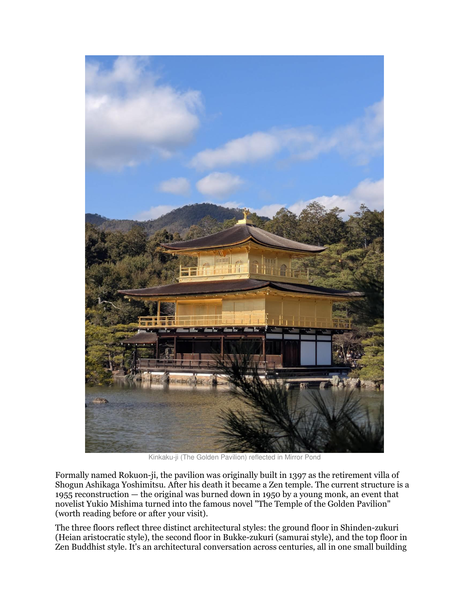
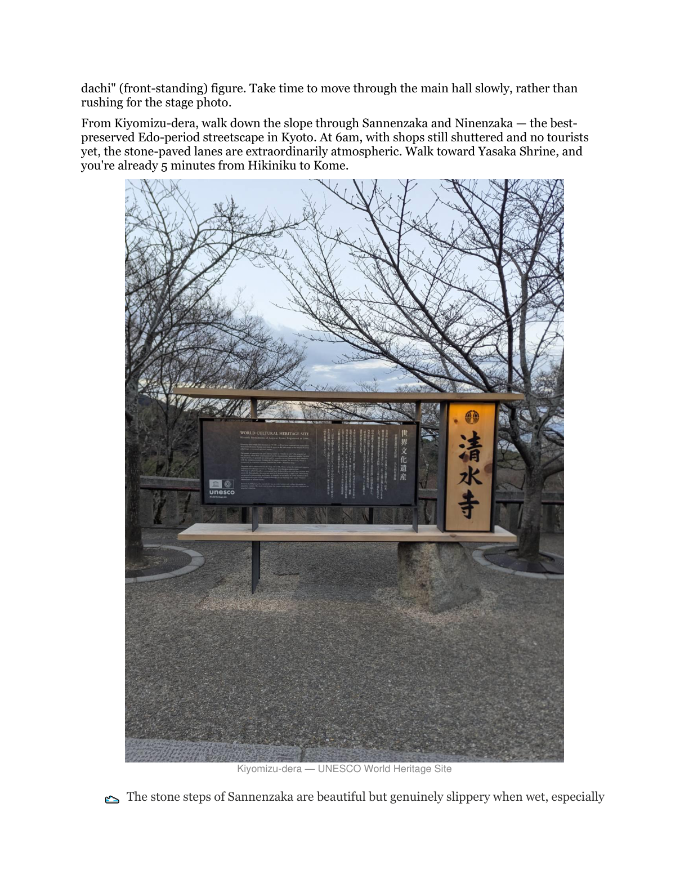

---
title: 'Kyoto Without the Tourist Script'
slug: 'kyoto-travel-guide'
description: 'Most Kyoto guides send you to the same crowded spots. Here is a different approach to visiting Kyoto that focuses on timing, neighborhoods, and the experiences that reward the independent traveler.'
keywords: ['Kyoto travel', 'Japan travel guide', 'Kyoto itinerary', 'Japan independent travel', 'Kyoto off the beaten path', 'travel planning', 'Kyoto tips']
author: 'Jerry Hu'
date: 2026-08-01
cover: ./kyoto-travel-guide-cover.png
category: 'guides'
tags: ['KDP', 'Travel', 'Kyoto', 'Japan']
locale: 'en'
brand: select
selectCategory: travel-food
draft: false
affiliate:
  amazon: 'https://www.amazon.com/dp/B0GX2YCSN4'
---

Kyoto has a problem that most cities would envy. It is too popular. The temples, the bamboo grove, the geisha district, these are genuine cultural treasures that draw visitors from everywhere. They are also so crowded during peak hours that the experience can become the opposite of what you traveled across the world to find. You came for tranquility and instead you are shuffling through a corridor of selfie sticks.

This is not an argument against visiting Kyoto. It is an argument against visiting Kyoto the way most travel guides tell you to.

## The Timing Lever

The single most effective strategy for enjoying Kyoto is not finding hidden spots. It is showing up at the right time. Kinkaku-ji (the Golden Pavilion) at 9 AM is a crowd. Kinkaku-ji at 7:30 AM is a different experience entirely.

 The temple opens at 7:00 during peak season. The visitors who arrive in the first thirty minutes get the reflective pond mostly to themselves. The same principle applies to the Arashiyama Bamboo Grove, which is genuinely peaceful at dawn and genuinely packed by 9:30.

Reverse timing works for evening destinations. Yasaka Shrine and Maruyama Park are lovely during the day but transform at night when the lanterns come on and the crowds thin. Walking through Gion after 8 PM, when the day-trippers have left and the district returns to something closer to its real character, reveals a version of Kyoto most visitors never see.

The practical takeaway: plan each day around one major destination at opening time, and leave the middle of the day for activities where crowds matter less, like shopping, casual dining, or resting at your accommodation. Then reclaim the evening for the atmospheric experiences.

## Neighborhoods Over Attractions

The common mistake is building a Kyoto itinerary around a list of temples and shrines. Temples are wonderful, but traveling between them eats time and energy. A better approach is to pick a neighborhood for each day and explore what is there, letting the discoveries happen organically rather than ticking boxes.

Higashiyama, the district between Kiyomizu-dera and Yasaka Shrine, is dense with smaller temples, pottery studios, and tea houses that do not appear in the top ten lists but offer a more intimate experience.

 Northern Kyoto, around Daitoku-ji and the Kamogawa River, has a quieter character with excellent temple gardens and fewer crowds. The area around the Imperial Palace is a grid of small galleries, craft shops, and restaurants that cater to locals rather than tourists.

Each neighborhood has its own rhythm. Spending a full afternoon in one area, with a loose plan and room to wander, produces more memorable experiences than rushing between five famous sites. This is especially true for the smaller temples, many of which have gardens that rival the famous ones but charge a fraction of the entrance fee and attract a fraction of the visitors.

## The Practical Details That Matter

A few practical points that guides tend to gloss over. Public transportation in Kyoto is good but not as intuitive as Tokyo's. The bus system covers most tourist areas but can be slow during peak hours. Renting a bicycle is faster for many routes and gives you the flexibility to stop when something catches your attention. Many accommodations offer bike rental or can recommend a nearby shop.

Dining in Kyoto rewards advance thinking. Popular restaurants, especially those with limited seating, often have lunch queues starting before they open. The alternative is to eat at odd hours, have a late lunch around 2 PM, and you will often walk straight in. Convenience store food in Japan is vastly better than its reputation, and a breakfast of onigiri and egg salad from a convenience store can free up your morning for the timing strategy described above.

Temple etiquette matters more than most visitors realize. The bathing ritual at a temple fountain is not a game. You rinse the ladle, pour water over your left hand, then your right, then rinse the ladle and return it. You do not drink from the ladle or put your mouth on it. Small details like this are noticed and appreciated. A guidebook that covers these specifics is worth having.

## The Regret That Travelers Report

The most common regret among first-time Kyoto visitors is not "I should have seen more temples." It is "I should have slowed down." The city rewards stillness. Sitting at a temple garden for twenty minutes after you have looked at everything is not wasted time. The garden changes as the light shifts. The sound of the bamboo water feature, the position of the shadows, the other visitors coming and going, these layers reveal themselves only when you stop moving.

If you plan one thing, plan an afternoon at a temple with a notable garden. Ryoan-ji and Tenryu-ji are the famous ones, but Daitoku-ji's subtemples, especially Daisen-in, offer gardens that are less crowded and equally profound. Bring nothing. Sit on the edge of the veranda. Watch the garden for as long as you can stand to sit still. That single afternoon will stay with you longer than any checklist of attractions.

The book I wrote on this topic covers Kyoto in practical detail. It includes specific timing recommendations for every major site, neighborhood walking routes that minimize backtracking, a restaurant guide organized by budget and setting, and the cultural etiquette that makes your visit smoother. It is written for the traveler who wants depth without the crowds.

> For the full guide with timing tables, neighborhood maps, and dining recommendations, see [Kyoto No-Regrets Travel Guide on Amazon](https://www.amazon.com/dp/B0GX2YCSN4).
