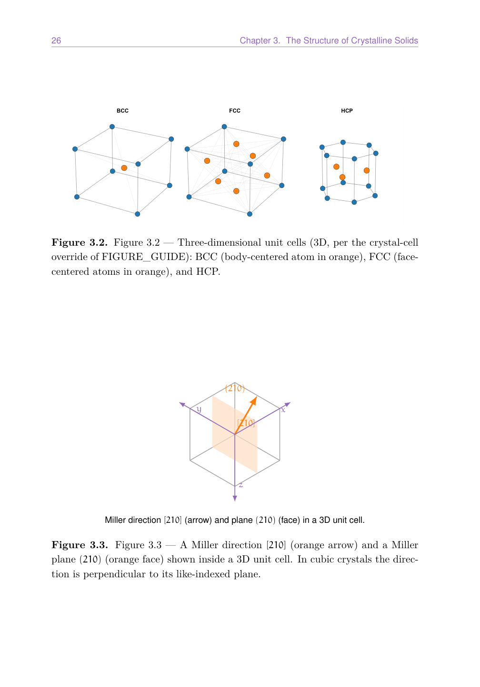
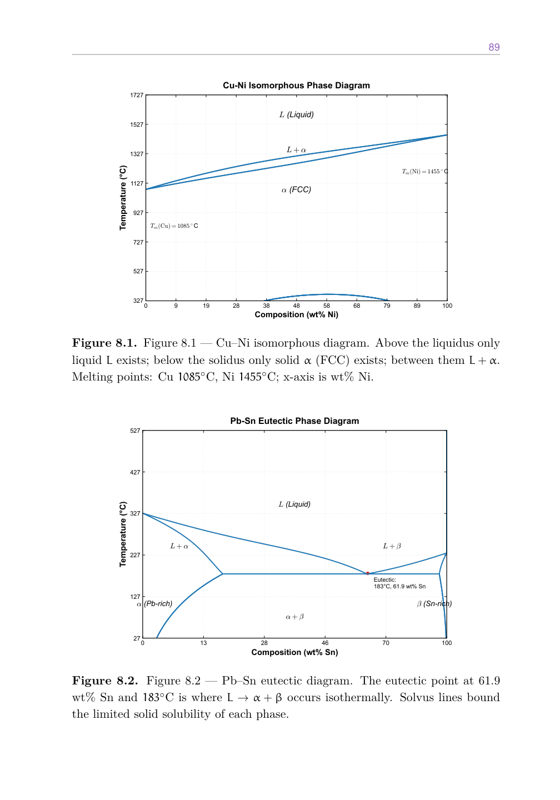

---
title: 'How to Study Materials Science Without Drowning in Derivations'
slug: 'materials-science-guide'
description: 'Materials science textbooks bury you in math before you grasp the concepts. Here is a different approach, using active recall and structured notes to learn crystal structures, phase diagrams, and mechanical properties.'
keywords: ['materials science', 'engineering study guide', 'crystal structures', 'phase diagrams', 'materials science textbook', 'engineering student', 'materials science workbook']
author: 'Jerry Hu'
date: 2026-08-06
cover: ./materials-science-guide-cover.png
category: 'guides'
tags: ['KDP', 'Materials Science', 'Study Guide', 'Engineering']
locale: 'en'

draft: false
---

Materials science occupies an awkward spot in the engineering curriculum. It is not purely theoretical like thermodynamics, and it is not purely applied like mechanics. It sits in the middle, demanding that you understand atomic-scale phenomena well enough to predict macroscopic behavior. This is hard because the intuitive models that work for larger scales (rigid bodies, continuous fluids) break down at the atomic level. You cannot see a dislocation move, but you need to know how it moves to understand why metals deform the way they do.

Most textbooks handle this difficulty by leaning hard into mathematics. The derivations are thorough, the equations are numerous, and the reader is expected to work through each step. This approach works for students who already have strong intuition about the subject. For everyone else, the math becomes a barrier rather than a bridge. You can solve a diffusion equation without understanding what diffusion actually means at the atomic level. Many students do exactly that, pass the exam, and retain almost nothing.

## Concepts First, Math Second

A better sequence is to understand the physical phenomenon first, then learn the math that describes it. Diffusion, for example, is conceptually simple. Atoms vibrate. Occasionally one jumps into a neighboring vacancy. Over time, this produces a net movement from high concentration to low concentration. Once you have that image in your head, Fick's laws become descriptions of something you already understand, rather than abstract differential equations you have to memorize.

This is the philosophy behind the study guide I wrote on this topic. Each chapter opens with the physical concept, illustrated and described in plain language. The equations come after, and they are presented as tools for calculation rather than objects of study in themselves. The worked examples show you how to use the math without making you derive it.

## The Topics That Matter Most

A standard materials science course covers five major areas. Crystal structures, including BCC, FCC, and HCP lattices, atomic packing factor, and Miller indices. Defects and diffusion, including vacancies, dislocations, grain boundaries, and Fick's first and second laws. Phase diagrams, including binary phase diagrams, the lever rule, and eutectic systems. Mechanical properties, including stress-strain behavior, hardness, fatigue, and fracture. And phase transformations, including nucleation, growth, and heat treatment.

Within each area, a small number of concepts carry most of the exam weight. In crystal structures, if you understand how to calculate atomic packing factor and how to determine Miller indices, you cover most of what gets tested.

In phase diagrams, the lever rule and eutectic reactions appear repeatedly. The trick is knowing which topics to prioritize and which to treat as secondary, which is exactly what a well-structured study guide provides.

## Active Recall as the Default

The single most effective change you can make to your study approach is switching from passive reading to active recall. Instead of reading a chapter and highlighting key points, you read a section, close the book, and write down what you remember. Then you check and fill in the gaps.

This feels harder than reading, which is why most students avoid it. The effort is the point. Every time you retrieve a concept from memory, you strengthen the neural pathway that leads to it. The more effortful the retrieval, the stronger the memory. A study guide that builds in this structure, with fill-in sections after each topic, practice problems that require recall rather than recognition, and spaced review prompts, can roughly double retention compared to rereading.

## The Study Guide Approach

The materials science study guide I put together follows this structure. Each chapter has a concept summary, a worked example, a set of practice problems with spaces to write solutions, and a self-check list. The goal is not to replace your textbook. It is to give you a focused, portable resource that you can work through in study sessions of any length.

The guide emphasizes the topics that undergraduates consistently find most challenging. Phase diagram interpretation is a common stumbling block, and the guide includes multiple practice diagrams with step-by-step walkthroughs.

 Miller indices confuse many students, and the guide provides a systematic method for determining them that works every time. Diffusion calculations trip up students who are not comfortable with exponential functions, and the guide includes a math review section specifically for the equations that appear in materials science.

If you are taking a materials science course and finding that the textbook is too dense to learn from directly, the guide offers a parallel path. It covers the same material at the same depth, but the presentation is designed for retention rather than reference.

> For a complete set of study materials including practice problems and self-checks, see [Materials Science Study Guide on Amazon](https://www.amazon.com/dp/B0H8TMBJ4T).
