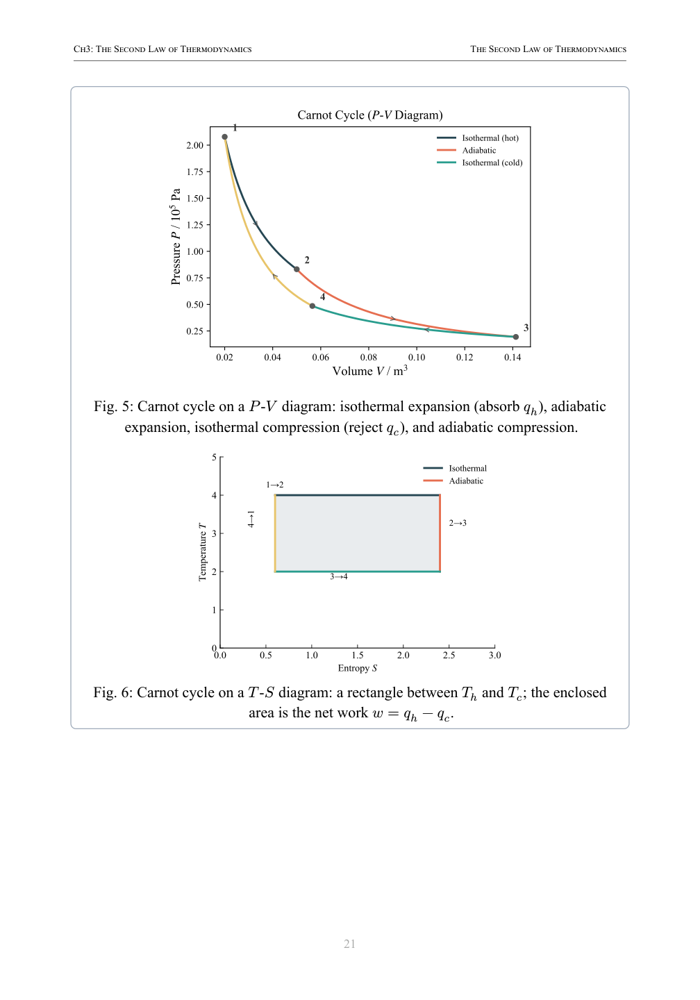
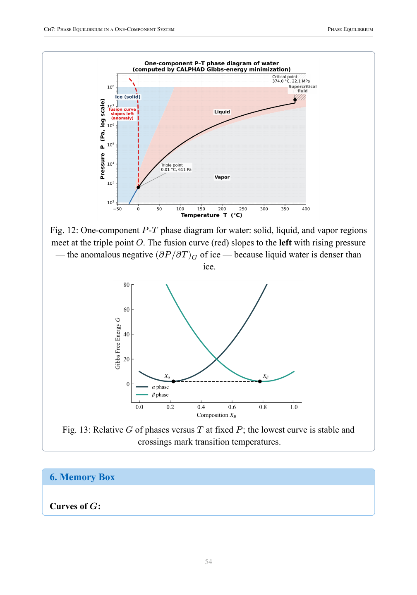

Thermodynamics has a reputation among engineering students that precedes it. It is the course that filters out the people who were not serious. The equations are numerous, the notation is dense, and the problems require a kind of systematic thinking that does not come naturally to everyone. But here is the thing. Thermodynamics is not actually that conceptually complex. The underlying ideas are remarkably few. What makes it hard is that the mathematical formalism is taught before the physical intuition, and students end up manipulating symbols they do not understand.

## The Three Big Ideas

Every thermodynamics problem in materials science reduces to three core concepts. The first is that systems tend toward lower energy. A ball rolls downhill because gravitational potential energy decreases. A chemical reaction proceeds in a particular direction because the Gibbs free energy of the products is lower than that of the reactants. The same principle governs phase transformations, diffusion, and solubility.

The second is that systems tend toward higher entropy. Entropy is often described as disorder, but that is a simplification. More precisely, entropy measures the number of ways a system can arrange itself at a given energy. Systems evolve toward states that have more available configurations because those states are statistically more likely. A drop of food coloring spreading through water is entropy at work.

The third is that the balance between energy and entropy determines equilibrium. This is the Gibbs free energy, G = H minus TS. When free energy is minimized, the system is stable. A phase transformation happens when the free energy of the new phase becomes lower than that of the old phase. A reaction stops when the free energy of the mixture is at its minimum. Almost every problem in materials thermodynamics is, at its core, a question about which state has the lowest free energy under given conditions.

Everything else, the partial derivatives, the Maxwell relations, the activity coefficients, is a tool for calculating or measuring that free energy. The tools matter, but they make much more sense once the core idea is clear.

## Where Students Get Stuck

Three specific topics cause disproportionate difficulty, and they are worth addressing directly.

The first is phase diagrams and the lever rule. The lever rule is a simple geometric calculation. The frustration comes from not understanding what it represents. The lever rule calculates the relative amounts of two phases at a given composition and temperature. That is all it does. If you approach a phase diagram problem by first asking "what phases are present?" and then "how much of each?", the lever rule becomes a straightforward second step rather than a mysterious formula.

The second is chemical potential and activity. Chemical potential is the partial molar Gibbs free energy. It tells you how the free energy of a system changes when you add a small amount of a component. Activity is a way of expressing chemical potential relative to a standard state. These concepts feel abstract until you recognize them as the thermodynamic driving force for diffusion and reaction. A component moves from where its chemical potential is high to where it is low. That is the entire mechanism.

The third is the phase rule. The phase rule, F = C minus P plus 2, tells you how many variables you can independently control in a system at equilibrium.

 Students memorize it but do not internalize it. The phase rule is a powerful sanity check. If you are analyzing a binary phase diagram and your calculation claims you can vary both temperature and composition while keeping three phases in equilibrium, the phase rule tells you that is impossible. It catches mistakes before you commit to them.

## A Different Approach to Studying

The most effective way to learn thermodynamics is to alternate between conceptual understanding and problem solving. Read a section until you can explain the core idea to someone else in plain language. Then work a problem that uses that idea. Then return to the text to fill in any gaps that the problem revealed.

This alternating rhythm builds both intuition and calculation skill at the same time, and it prevents the common failure mode of being able to solve problems without understanding them. Many students can calculate the free energy change of a reaction correctly and have no idea what the number means. The number tells you whether the reaction is spontaneous. If you cannot interpret the result, the calculation was a waste of time.

The book I wrote on this topic, Materials Thermodynamics Notes, is organized around this approach. Each chapter opens with a clear statement of the physical concept. Worked examples follow, showing not just the calculation steps but the reasoning behind each step. Practice problems with answer keys let you verify your understanding. The final section of each chapter summarizes the key equations and the situations in which they apply.

The book is not a replacement for a thermodynamics textbook. It is a companion designed to make the textbook readable. If the standard thermodynamics text feels like it is speaking a language you have not learned yet, these notes provide the translation.

> For a structured approach to thermodynamics that builds intuition before calculation, see [Materials Thermodynamics Notes on Amazon](https://www.amazon.com/dp/B0H93B39Q8).
