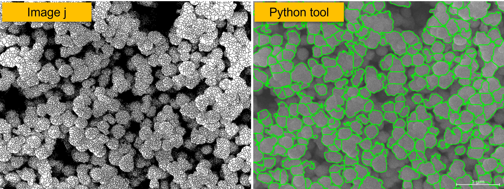

Quantifying particle size distribution is a frequent and foundational task in materials research and quality control. The typical workflow begins with a scanning electron microscopy (SEM) image, after which the mean diameter, distribution width, and characteristic values such as D10, D50, and D90 must be reported. Manual measurement by hand is time consuming and introduces inter-operator variability in how boundaries are drawn. The SEM Particle Analyzer described here targets this need: it produces reproducible numbers through a consistent, automated pipeline.


## What the tool does

The tool loads an SEM image (TIF, PNG, or JPG), detects every particle or pore in the frame, measures each diameter, and outputs a size distribution. No manual outlining is required, and no commercial image-analysis license is needed.

Two core algorithms are provided:

- Watershed: suited to dense, overlapping particles. The pipeline enhances contrast, uses a distance transform to locate seed points per particle, and separates touching clusters.
- Hough Circle: suited to particles with well-defined circular edges. It detects circle centers and radii directly and yields tight measurements.

Pore analysis is also supported by switching to pore mode. This is relevant to battery electrodes, porous ceramics, and membranes, where pore size and distribution inform porosity and transport behavior.

## The problem it addresses

Manual sizing carries three limitations. Efficiency is the first: a single image often holds hundreds of particles, and measuring each is slow. Objectivity is the second: boundary and membership judgments vary between operators, so reported values are hard to reconcile. Reproducibility is the third: after months have passed, unless the measurement method was recorded, the data is difficult to verify again.

The tool fixes "how to measure" into a defined procedure. The same image as input yields the same result regardless of who runs it. This property supports data presentation in publications, responses to reviewer comments, and handoffs of datasets within a lab.



## Who it is for

- Quick size checks after synthesis: nanoparticle powders, metal particles, catalysts.
- Pore analysis on films and porous materials, where size and distribution are the basis for discussing porosity and transport.
- Coursework and project reports, where students may lack a license for commercial software.
- Batch processing of many samples: one command analyzes a whole folder, useful when statistical comparison is required.

## Install and setup

The runtime requires Python 3.8 or newer. Install the dependencies:

```bash
pip install opencv-python numpy pandas matplotlib scipy scikit-image pillow
```

For the graphical interface, run:

```bash
python particle_analyzer_gui.py
```


## Step one: calibrate the scale

An SEM image measures length in pixels, while the analysis target is normally microns. Calibration is therefore a required preprocessing step. Two approaches are available:

Interactive calibration is the most direct. After loading, click the two ends of the scale bar and enter the real length it represents in microns; the tool computes the microns-per-pixel ratio from that.

Auto detection suits batch work. The tool attempts to locate the scale bar on its own, and with `--no-interactive` it processes a whole folder without manual intervention.

If the ratio is already known, it can be supplied directly to skip calibration:

```bash
python particle_analyzer.py sample.tif -m watershed -p 0.01
```

Here `-p 0.01` means each pixel equals 0.01 micron.

## Step two: pick an algorithm and run

The GUI finishes in a few clicks. The command line is documented below because it integrates well into scripts and scheduled jobs:

```bash
# Watershed analysis (interactive calibration)
python particle_analyzer.py sample.tif -m watershed

# Hough Circle analysis (set scale bar length directly)
python particle_analyzer.py sample.tif -m hough -r 1.0

# Non-interactive batch over a whole folder
python particle_analyzer.py *.tif -m watershed --no-interactive -l 1.0
```

Flag notes: `-m` chooses watershed or hough; `-r` is the real scale bar length in microns; `-l` gives microns per pixel directly.

Common tuning flags:

- `--min-dist`: minimum center distance between particles in pixels, default 12. Raise it when particles crowd.
- `--min-area`: minimum area filter, default 30 square pixels, used to drop noise.
- `--hough-min-r` / `--hough-max-r`: radius bounds for Hough circles.
- `--param1` / `--param2`: Hough Canny high threshold and accumulator threshold, default 50 and 30 respectively.


## What the output looks like

After analysis, four files are written to the same folder:

- `*_diameters.csv`: the diameter of every particle in microns, ready for box plots or further statistics.
- `*_statistics.txt`: a summary with count, mean, D10, D50, D90 and more. D50 is the diameter at 50 percent cumulative, and is widely reported in the literature.
- `*_overlay.png`: the segmentation overlay with regions and a scale bar, usable directly as a figure.
- `*_distribution.png`: a dual-axis log plot, frequency percent on the left and cumulative passing on the right, from which distribution skew is read at a glance.

## Practical use

With D50 and the distribution width in hand, you can compare particle size across synthesis conditions: temperature, additives, reaction time. Batch mode pushes through dozens of images, consolidates the results, and plots the trend far more efficiently than manual work.

For reports and teaching, the overlay and distribution images are citation-ready assets that need no second tool to redraw.

## Benefits and limits

The benefits are that the tool is free, open source, runs offline, and produces reproducible results; both GUI and CLI are complete, which is valuable for users without a commercial license.

On the limits, segmentation quality depends on image contrast. If the SEM image is noisy, or particles and background are too close in grayscale, measurement accuracy degrades and parameters must be revisited or the image preprocessed. Also, the tool measures a 2D projection; a rigorous volume distribution still requires other methods to corroborate.

## Wrap-up

This tool converts SEM particle sizing from tedious manual measurement into a standard pipeline of a few commands or clicks. It does not replace the researcher's judgment about the material, but it returns the time spent on repetitive measurement to more substantive analysis. The source and a built executable are on GitHub, and you are welcome to take and modify them.
