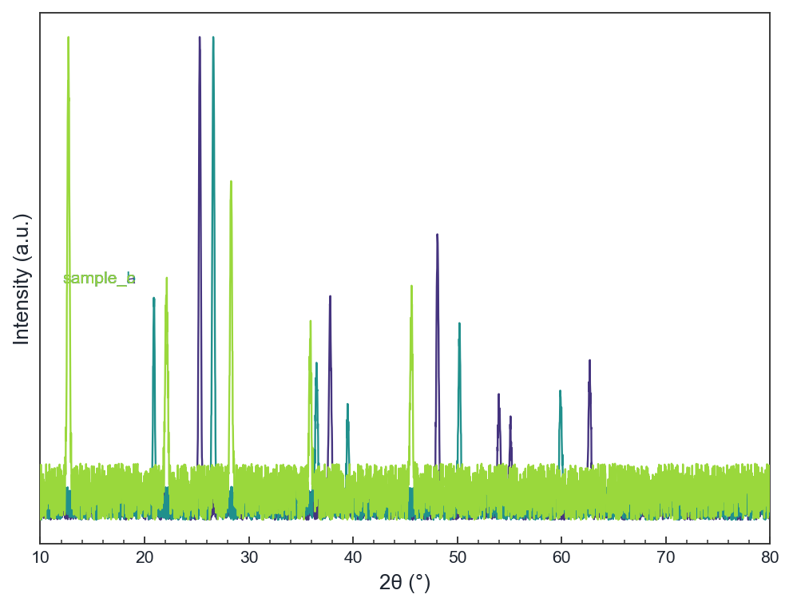

In materials, chemistry and physics labs, plotting spectral data is a daily task that rarely gets the attention it deserves. The usual workarounds are: Excel (tedious formatting, inconsistent output quality), expensive commercial software (licenses cost hundreds to thousands of dollars, out of reach for many students), or hand-written Python scripts (rewritten from scratch every time). Spectra Studio was built for exactly this need: free, no installation headaches, ready to use in seconds, and designed to produce reproducible, journal-ready figures through a consistent workflow.

## What the Tool Does

Spectra Studio loads common spectral data formats and provides live preview plus a complete analysis toolbox:

- **Multi-format loading**: XRD (.txt / .xy / .csv / .dat), FTIR (.asc, with automatic wavenumber-axis correction), RAMAN and DSC/TGA (Excel .xlsx / .xls), and PDF# reference cards
- **Multi-sample management**: overlay, stack, normalize, vertical offset, batch coloring
- **Preprocessing**: Savitzky-Golay smoothing, ALS baseline correction
- **Peak analysis**: automatic peak detection, peak fitting (Gaussian / Lorentzian with position, FWHM, area, R² and residuals)
- **Phase matching**: compare sample peaks against PDF reference cards, annotate phases directly on the plot
- **Journal styles**: one-click Nature / ACS / Elsevier styles, Miller index annotation, legend placement, fonts, tick direction — all fine-tunable
- **High-resolution export**: PNG / JPG / TIFF / PDF / SVG / EPS with live preview before saving

## The Problems It Solves

Spectral plotting suffers from a few recurring pain points that Spectra Studio is designed to eliminate:

1. **Software cost**: Commercial tools (Jade, Match!, OriginPro) cost hundreds to thousands of dollars. Individual researchers and students often cannot afford them. The free edition covers all everyday plotting needs.
2. **Format drudgery**: Different instruments produce different file formats; manual cleanup is time-consuming and error-prone. The tool auto-detects format by extension and content — drop the file in and it plots.
3. **Repetitive work**: The same dataset often needs several versions (different styles, different ranges). Every setting previews live, so you adjust and export without redoing anything.
4. **Output quality**: Journals impose strict requirements on resolution, format and layout. Built-in journal styles and vector export produce submission-ready figures.

## Free vs. Pro

Spectra Studio uses a **freemium** model — the free edition is a complete everyday tool with no time limits and no watermarks:

**Free ($0, forever)**
- Data loading and multi-sample management, live plotting preview
- Smoothing, baseline correction, peak detection
- PNG / JPG export (up to 300 DPI)

**Pro ($79; student $39; lab license $249 for 5 seats)**
- Peak fitting (Gaussian / Lorentzian with R² and residuals)
- Phase matching (PDF cards) and Miller index annotation
- Derivative / integral calculus
- Vector export (PDF / SVG / EPS / TIFF) and high DPI
- Advanced output settings

The student edition runs on the honor system: current students may purchase it, and are expected to upgrade to Pro after graduation.

## Installation & Download

**System requirements**: Windows 10 or later (64-bit). No Python or dependencies needed.

Two ways to install:

1. **Setup program** (recommended): [Download SpectraStudio-Setup-v2.0.0.exe (120 MB)](https://github.com/hujerry96/Web/releases/latest/download/SpectraStudio-Setup-v2.0.0.exe), double-click to install into the current user's directory (no administrator rights needed), with Start-menu shortcut and uninstaller.
2. **Portable build**: [Download SpectraStudio.exe (120 MB)](https://github.com/hujerry96/Web/releases/latest/download/SpectraStudio.exe) and double-click to run.

> ⚠️ **About the SmartScreen warning**: The software does not yet have a code-signing certificate. Windows may show a "Windows protected your PC" warning — click "More info" → "Run anyway" to continue. We plan to add signing as soon as revenue allows.

**SHA-256 checksums** (verify file integrity after download):

- Setup `SpectraStudio-Setup-v2.0.0.exe`: `c0ff2fd0a7c6db93f082d7abf583b5b559d1ec2b9e4eef26af0deace75555c48`
- Portable `SpectraStudio.exe`: `7710d08df4423cc69fd5627f349eddbde78fab862023979bcc7bb7eeca41303a`

Updates: the app silently checks for new versions on startup (prompt only, never forced).

## Privacy

All data is processed locally on your machine — **no data files are ever uploaded**. License verification is offline; only the version number is checked on startup. See the [privacy policy](/privacy.md) for details.

## FAQ

**Q: Is there a Mac or Linux version?**
Windows only for now; a macOS build is planned.

**Q: Can I use the free edition for published data?**
Yes. The free edition covers everyday plotting, exports have no watermarks, and figures can be used freely in papers and reports.

**Q: Can I export peak-fitting results?**
Yes. The Pro edition reports each fitted peak's parameters plus residuals, ready for supplementary materials.

**Q: What if I switch computers?**
Licenses are bound offline. If you change machines, contact us with your machine code for a key reissue (keep your purchase receipt).

**Q: Is student verification required?**
No. We run on the honor system — please purchase the edition that matches your situation.
