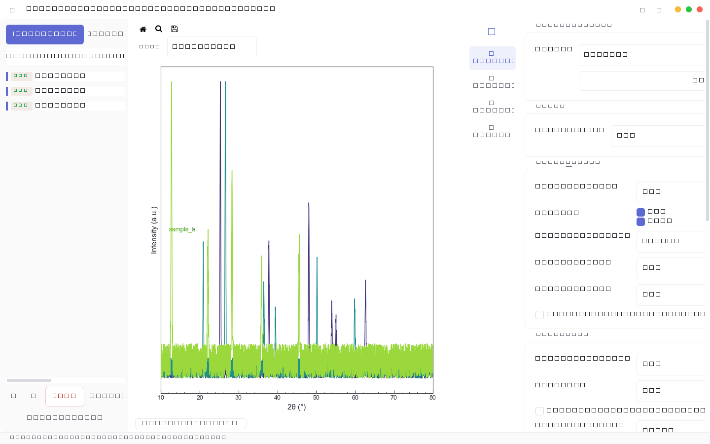
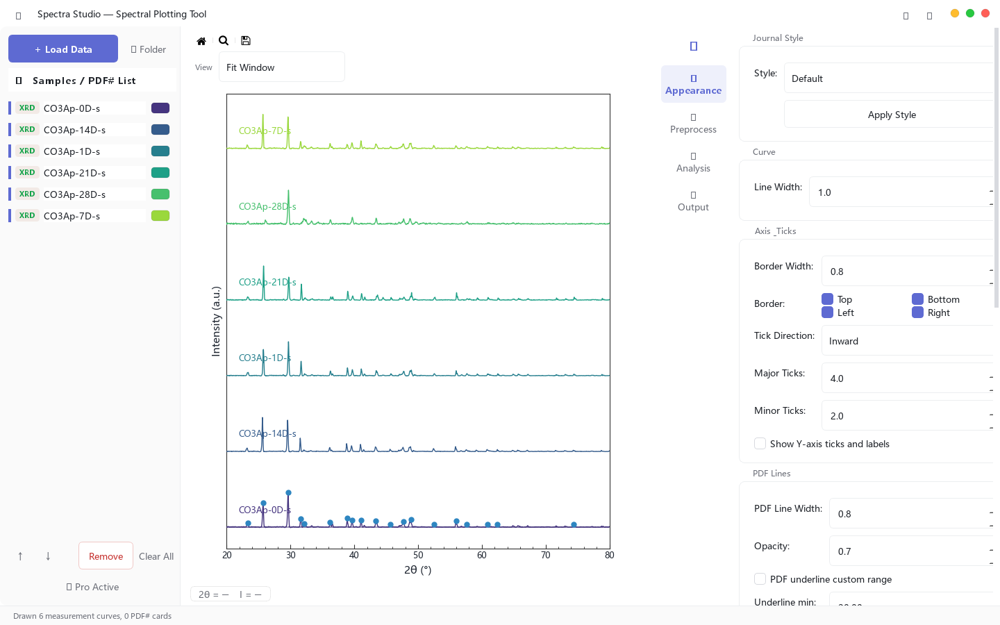
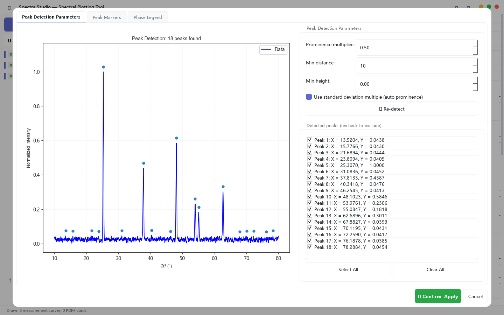
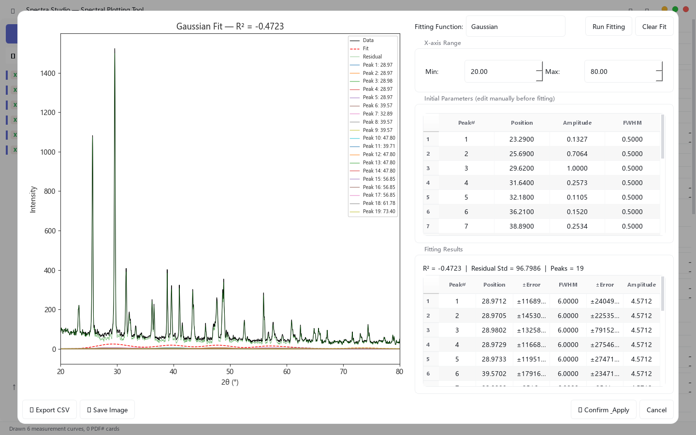

In materials, chemistry and physics labs, plotting spectral data is a daily task that rarely gets the attention it deserves. The usual workarounds are: Excel (tedious formatting, inconsistent output quality), expensive commercial software (licenses cost hundreds to thousands of dollars), or hand-written Python scripts (rewritten from scratch every time). Spectra Studio was built for exactly this need: **free, ready to use in seconds, and designed to produce reproducible, journal-ready figures through a consistent workflow.**

## 🎬 Spectra Studio in 60 Seconds

<video controls preload="none" poster={`${import.meta.env.BASE_URL.replace(/\/$/, '')}/videos/spectra-studio-poster.jpg`} style={{ width: '100%', borderRadius: '12px', border: '1px solid var(--color-border)', background: '#000' }}>
  <source src={`${import.meta.env.BASE_URL.replace(/\/$/, '')}/videos/spectra-studio-demo.mp4`} type="video/mp4" />
  Your browser does not support video playback — <a href={`${import.meta.env.BASE_URL.replace(/\/$/, '')}/videos/spectra-studio-demo.mp4`}>download the video</a> instead.
</video>

## Quick Start: What You Get in the Free Download

The installer you download is the complete application — **all Free-edition features work immediately**. Pro features are already built into the same installer; buy a key and they unlock instantly, with no re-download.

The Free edition ($0, forever, no watermarks) includes:

- **Data loading**: instrument files read directly — PANalytical (.xrdml), Bruker (.brml), generic .uxd — plus .txt / .xy / .csv / .dat, FTIR (.asc), DSC/TGA (Excel .xlsx / .xls)
- **Multi-sample management**: overlay, stack, normalize, vertical offset, batch coloring
- **Preprocessing**: Savitzky-Golay smoothing, ALS baseline correction
- **Peak analysis**: automatic peak detection
- **Journal styles**: one-click Nature / ACS / Elsevier, fine-tunable legend and ticks
- **Export**: PNG / JPG (up to 300 DPI), watermark-free, free to use in papers and reports

## Step by Step: A Journal Figure in 10 Minutes

Here is the full workflow, using "three XRD samples → an ACS-style submission figure" as the example.

### Step 1: Load Your Data

Click "Load data" and pick files (or drag & drop them into the window). Multiple files load at once — the sample list on the left fills in and the curves appear immediately. Stack, normalize and vertical-offset options keep multi-sample comparisons clear.

### Step 2: Preprocess (Smoothing + Baseline)

Adjust the smoothing window (Savitzky-Golay) and baseline parameters (ALS) in the preprocessing panel — **every change previews live**. A typical workflow: smooth with a window of 9–15 to remove noise, then flatten the background with baseline correction.

### Step 3: Automatic Peak Detection

Click "Auto peak detection" and the tool marks candidate peaks based on height and shape (sensitivity is adjustable). Detected peaks appear in a table and are annotated on the plot for immediate review.

### Step 4: Peak Fitting (Pro)

For overlapping peaks, use peak fitting: the tool seeds initial values from the detection results and fits Gaussian / Lorentzian (or mixed) profiles, reporting each peak's **position, FWHM, area, R² and residuals** — a results table you can paste straight into supplementary materials.

### Step 5: Apply a Journal Style

Switch between Nature / ACS / Elsevier styles with one click; legend position, fonts, line widths and tick directions are all fine-tunable. Pro adds Miller-index annotation and phase-matching labels on the plot.

### Step 6: Export

Preview before saving, then pick a format and resolution. PNG / JPG go up to 300 DPI; Pro unlocks PDF / SVG / EPS / TIFF vector export and higher resolutions — submission figures leave from here.

## Feature Details

### Supported Data Formats

| Instrument / type | Formats | Notes |
|---|---|---|
| PANalytical (X'Pert etc.) | .xrdml | XML scan data read directly — no export roundtrip |
| Bruker (DIFFRAC etc.) | .brml | XML scan data read directly — no export roundtrip |
| Generic instruments | .uxd | two-column text (2θ–intensity) |
| XRD powder diffraction | .txt / .xy / .csv / .dat | 2θ–intensity columns auto-detected |
| FTIR | .asc | wavenumber axis direction auto-corrected |
| RAMAN | .txt / .xy / .csv | same loading flow as XRD |
| DSC / TGA | .xlsx / .xls | read Excel sheets directly |
| PDF# reference cards | built-in format | used for phase matching (Pro) |

### Peak Analysis

- **Auto peak detection**: height/shape-based detector with adjustable sensitivity
- **Peak fitting (Pro)**: Gaussian / Lorentzian / mixed profiles; automatic initial values (seeded from detection); outputs position, FWHM, area, R², residuals; results table exportable
- **Calculus (Pro)**: first derivative (inflection/phase-transition points) and integration (area/crystallinity)

### Phase Matching (Pro)

Sample peaks are matched against PDF reference cards, with the corresponding phase and Miller indices (hkl) annotated directly on the peaks, including a tolerance setting. "Is this the α phase or the β phase?" — answered in seconds.

### Journal Styles

| Style | Character |
|---|---|
| Nature | borderless, minimal, compact fonts |
| ACS | left/bottom axes, bold lines, in-figure legend |
| Elsevier | full box frame, classic academic layout |

Every style remains fine-tunable: fonts, sizes, line widths, tick direction/length, legend position, axis ranges, titles.

### Export Formats

| Format | Free | Pro |
|---|---|---|
| PNG / JPG | ✅ (≤300 DPI) | ✅ (up to 600 DPI) |
| PDF / SVG / EPS | — | ✅ (vector, ideal for submission) |
| TIFF | — | ✅ (300/600 DPI presets) |

## Free vs. Pro

Spectra Studio comes in two editions only: **Free** and **Pro**. The free edition is a complete everyday tool — no time limits, no watermarks. Pro adds advanced analysis and vector export.

| | Free | Pro |
|---|---|---|
| Price | $0 (forever) | $79 (one-time) |
| Data loading & multi-sample management | ✅ | ✅ |
| Smoothing, baseline correction, peak detection | ✅ | ✅ |
| Journal styles & PNG/JPG export (≤300 DPI) | ✅ | ✅ |
| Peak fitting (with R² and residuals) | — | ✅ |
| Phase matching (PDF cards) & Miller indices | — | ✅ |
| Derivative / integral calculus | — | ✅ |
| Vector export (PDF / SVG / EPS / TIFF) & high DPI | — | ✅ |

**Pro is already complete**: every Pro feature is finished and built into the v2.0.3 installer — nothing extra to download. After purchase, paste the key you receive by email under "🔑 Unlock Pro" in the app (one online verification on first activation, offline afterwards).

[🛒 Buy Pro on Polar ($79 one-time)](https://buy.polar.sh/polar_cl_DBZ8Ma2IljbS2HEgypycUbTTQQq3sVq3OGMvf4EKvmO)

- **One-time purchase**, permanent license (includes updates within the current major version)
- **30-day money-back guarantee**
- You receive the key (`XXXX-XXXX-...`) in your receipt email; re-paste it after reinstalling or switching machines

## Installation & Download

**System requirements**: Windows 10 or later (64-bit). No Python or dependencies needed.

Both options are identical in content — the full application including Pro features:

1. **Setup program** (recommended): [Download SpectraStudio-Setup-v2.0.3.exe (120 MB)](https://github.com/hujerry96/Web/releases/latest/download/SpectraStudio-Setup-v2.0.3.exe), double-click to install into the current user's directory (no administrator rights needed), with Start-menu shortcut and uninstaller.
2. **Portable build**: [Download SpectraStudio-v2.0.3-portable.exe (120 MB)](https://github.com/hujerry96/Web/releases/latest/download/SpectraStudio-v2.0.3-portable.exe) and double-click to run.

> ⚠️ **About the SmartScreen warning**: The software does not yet have a code-signing certificate. Windows may show a "Windows protected your PC" warning — click "More info" → "Run anyway" to continue. We plan to add signing as soon as revenue allows.

**SHA-256 checksums** (verify file integrity after download):

- Setup `SpectraStudio-Setup-v2.0.3.exe`: `59a31ddaaab1528789d2163127b6cb2786b24afb4c7cf2eff81c1934be6b5060`
- Portable `SpectraStudio-v2.0.3-portable.exe`: `db147c89d757c749507f31cf69656256d359550dd4e7c8e32e9ec22258a0db07`

Updates: the app silently checks for new versions on startup (prompt only, never forced).

## Privacy

All data is processed locally on your machine — **no data files are ever uploaded**. License verification is offline; only the version number is checked on startup. See the [privacy policy](/privacy.md) for details.

## FAQ

**Q: Is there a Mac or Linux version?**
Windows only for now; a macOS build is planned.

**Q: Can I use the free edition for published data?**
Yes. The free edition covers everyday plotting, exports have no watermarks, and figures can be used freely in papers and reports.

**Q: How do I activate Pro after buying?**
After purchasing on [Polar](https://buy.polar.sh/polar_cl_DBZ8Ma2IljbS2HEgypycUbTTQQq3sVq3OGMvf4EKvmO), Polar emails you a key (`SS_-XXXX-...` format). Click "🔑 Unlock Pro" in the sidebar, paste the key, and the features unlock immediately (one online verification on first activation, then 30 days fully offline with a brief daily online check) — no reinstall needed.

**Q: Can I export peak-fitting results?**
Yes. The Pro edition reports each fitted peak's parameters plus residuals, ready for supplementary materials.

**Q: What if I switch computers?**
Licenses are bound offline. If you change machines, contact us with your machine code for a key reissue (keep your purchase receipt).

**Q: Can I load data exported by my instrument software?**
Yes. Besides common .txt/.csv/.xy two-column files, native instrument files — PANalytical (.xrdml), Bruker (.brml) and .uxd — load directly, so no export-to-text roundtrip is needed; exports from other instruments (.txt/.csv) are auto-detected by content.

**Q: Can I output the same data in different styles?**
Yes. Style switches take effect instantly — produce a Nature version and an ACS version of the same dataset by switching and saving each.
