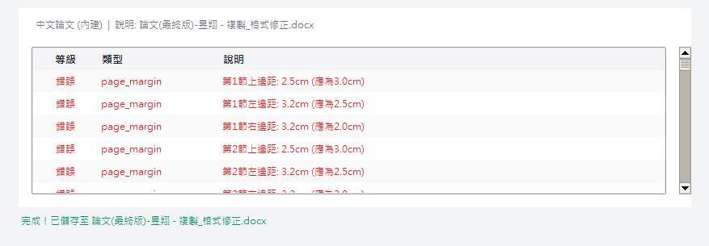

Bringing a master or PhD thesis into formal compliance is often a heavy and error-prone stage of the writing process. Institutional style guides are typically lengthy and demanding: Roman numerals for the front matter, Arabic for the body; figure numbers as "Figure 1.1" rather than "Figure 1-1"; heading levels, first-line indents, line spacing, and reference cross-references, any one of which can trigger a rejection. The Thesis Format Fixer presented here targets this repetitive, rule-defined work with an automated solution.


## What the tool does

The tool reads a Word document (.docx), performs a full scan, lists every formatting issue against the rules, then applies the fixes in a single run and saves a new file. The process is rule driven, and the rules live in a YAML file the user can edit.

Coverage spans: layout (margins, binding gutter, paper size), fonts (heading styles, unified Chinese and English fonts), spacing (1.5 line spacing, paragraph gaps, first-line indent), page numbers (Roman for front matter, Arabic for body, start number), table-of-contents styling, heading levels and page breaks, figure and table numbering and centering, reference cross-references, and cover spacing.

## The problem it addresses

Manual formatting carries three common limitations. It is tedious: a thesis of several hundred pages can consume considerable time on figure renumbering alone. It is prone to omission: after fixing a heading indent, one may overlook a figure still using the old number style. And it is hard to redo: when the advisor or committee changes the requirements, the entire document must be rechecked from the top.

The tool consolidates "check and fix" into a single operation. It scans, presents a list for confirmation, then fixes in batch. The process is transparent and reproducible, removing the need to flip page by page in search of format errors.



## Who it is for

- The final compliance check before sending a thesis to print: clearing common errors in one pass.
- A quick restructure of the whole document after the advisor or committee revises the requirements.
- A shared rule set within a lab, so that theses produced by different members stay consistent.
- Recovering a structurally disordered document to a usable state without rebuilding it from scratch.

## Install and setup

The runtime requires Python 3.8 or newer. Install the dependencies:

```bash
pip install -r requirements.txt
```

The requirements include python-docx, lxml, and PyYAML. The tkinter GUI ships with Python, so no separate install is normally needed.

## GUI: drop the file and run

The most convenient path is the GUI:

```bash
python main.py
```

Drag a Word file into the window, or click "Select File". The tool analyzes first and shows the fixable items on screen. Select what to fix, run it, and a `_fixed.docx` is saved alongside.

The top-right of the window switches language (中文 / English), and the choice is remembered, so the next launch opens in the selected language.


## Command line: use it inside scripts

If you want analysis or fixing embedded in your own pipeline, call it directly:

```python
from core.analyzer import FormatAnalyzer
from core.fixer import FormatFixer

# Analyze
analyzer = FormatAnalyzer('rules/thesis_zh.yaml')
issues = analyzer.analyze('thesis.docx')
for i in issues:
    print(f"[{i['type']}] {i['message']}")

# Fix
fixer = FormatFixer('rules/thesis_zh.yaml')
results = fixer.fix_document('thesis.docx', 'thesis_fixed.docx')
for r in results:
    print(f"[{r['type']}] {r['message']}")
```

`rules/thesis_zh.yaml` holds the Chinese format rules. Margins, fonts, line spacing, and numbering format all change in that YAML, with no code edits.

## What it actually fixes

The items most often sent back:

- Page numbers: Roman for cover and abstract, Arabic starting at page 1 for the body, switched automatically.
- Figure and table numbers: "Figure 1-1" becomes "Figure 1.1" and is centered.
- Heading levels: page breaks and numbering for headings 1 to 3, with "Chapter X" and "X." converted either way.
- References: the REF fields for cross-references and the reference list cleaned up.
- Cover and indent: cover spacing, configurable keywords, and a unified first-line indent across the document.

## Set your own rules

The bundled `rules/thesis_zh.yaml` targets common Chinese master and PhD specs, but you can change it. Adjustable items include: page margins and binding gutter, Chinese and English fonts and sizes, line spacing factor and paragraph gaps, first-line indent value, heading level settings, figure and table numbering format, page number style (Roman or Arabic), and cover detection keywords.

In other words, different specs from different schools apply by editing the YAML. Python code is never touched.


## Benefits and limits

The benefits are speed, reproducibility, and transparent rules. You see the list and confirm before anything changes, so there is no risk of unapproved edits to the content. It is open source and runs offline, and a shared rule set within a lab delivers real leverage.

On the limits, the tool applies rule-based fixes for specific formatting problems. If the source document is severely disordered, for example broken styles, mixed manual and styled formatting, or excessively nested anomalies, results may be incomplete. The tool states this itself: back up the original first, then review the output manually.

## Wrap-up

This tool does not help write the thesis content, but it compresses the most draining part, the repetitive format check, into three steps: drop the file, review the list, run the fix. Investing the saved time in refining the content is where its real value lies. The source and a built executable are on GitHub, and you are welcome to take them.
