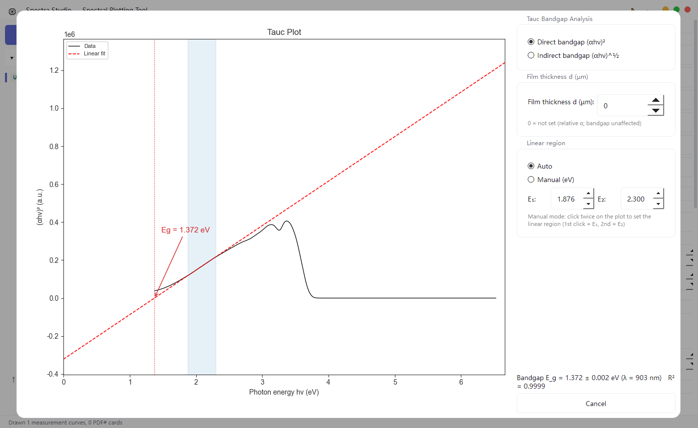

## What is a Tauc plot?

In semiconductor, photocatalyst, thin-film, perovskite and optoelectronic-material research, UV-Vis absorption data are often used to estimate an optical band gap. One of the most common approaches is the **Tauc plot**: transform the absorption spectrum, identify a suitable linear region near the absorption edge, and extrapolate the fitted line to the photon-energy axis to obtain `Eg`.

The important part is not simply drawing a line. You need to select a transition model—direct or indirect—and justify the linear region. A visually attractive fit can still produce an unreliable band-gap estimate if the model or region is inappropriate.


## The Tauc equation

A common form is:

```text
(αhν)^n = A(hν − Eg)
```

Where:

- `α` is the absorption coefficient;
- `hν` is the photon energy;
- `Eg` is the optical band gap;
- `A` is a proportionality constant;
- `n` depends on the transition type.

Two practical choices are especially common:

- **Direct allowed transition**: plot `(αhν)²` against `hν`.
- **Indirect allowed transition**: plot `(αhν)^(1/2)` against `hν`.

Fit the approximately linear region near the absorption edge and extend the line to `y = 0`. The x-axis intercept is the estimated `Eg`. If the transition type is uncertain, use the material's electronic structure, literature and experimental context rather than selecting the result that merely looks closest to expectation.



## From UV-Vis data to a Tauc plot

### Step 1: Prepare wavelength and absorbance data

Spectra Studio can load UV-Vis `.txt`, `.xy` and `.csv` files and automatically recognize wavelength data in nanometers. The common supported range is approximately 190–1200 nm.

If the instrument exports transmittance, reflectance or another quantity, confirm that it has been converted to a form appropriate for the intended absorption analysis. Record the conversion method; do not mix different physical quantities in one Tauc calculation.

### Step 2: Open Tauc Bandgap

After loading the spectrum, select **Tauc Bandgap**. The tool provides direct and indirect modes, converts wavelength to photon energy, applies the selected Tauc transformation and annotates the estimated `Eg` and its corresponding wavelength on the plot.

### Step 3: Choose an automatic or manual linear region

Spectra Studio first detects a candidate linear region and draws the fitted tangent, which is useful for a fast initial estimate. If the automatic selection does not cover the scientifically appropriate absorption edge, switch to manual mode and click two points on the plot: the first sets the start and the second sets the end of the region. The value is recalculated immediately.

Treat the automatic result as a starting estimate rather than a universal uncertainty guarantee. Before submission, inspect the original absorption spectrum, baseline, selected interval, fit quality and how sensitive `Eg` is to a small change in the interval.

### Step 4: Add film thickness when available

For a film with known thickness `d`, Spectra Studio can calculate the absorption coefficient using:

```text
α = 2.303A / d
```

Check the thickness units and make sure the units used for `α` are consistent with the rest of the analysis.

If thickness is unavailable, a relative absorption coefficient can still be used for a Tauc estimate. A constant scaling factor does not change the ideal x-axis intercept, although baseline quality, scattering and the choice of linear region can still change the result.

## Five common Tauc-plot mistakes

### 1. Treating the absorption-edge wavelength as the band gap

Wavelength and energy are different quantities. A Tauc analysis converts wavelength using `E = hc/λ` before fitting. The absorption-edge wavelength is a useful visual reference, but it is not a substitute for the stated transformation and extrapolation.

### 2. Failing to state the transition model

Different values of `n` can produce different `Eg` values from the same spectrum. State whether the analysis uses a direct or indirect model and explain the choice.

### 3. Fitting the entire curve

The approximate linear region is usually near the absorption edge. Including the low-energy tail, noisy region or strongly absorbing high-energy region can shift the extrapolated intercept.

### 4. Ignoring thickness and preprocessing

For films, thickness and baseline affect the absorption coefficient. For powders or samples with strong scattering, sample preparation and instrument geometry can also affect the apparent spectrum. These limitations belong in the methods or discussion.

### 5. Treating automatic selection as unquestionable

Automatic detection accelerates repetitive work, but it does not replace scientific review. Confirm that the selected region, transition model and resulting value are consistent with the material and relevant literature.


## Why use Spectra Studio for Tauc analysis?

Building a Tauc plot manually in Excel or Origin usually means repeating wavelength conversion, photon-energy calculation, alpha transformation, square or square-root operations, linear-region selection and plot annotations. A Python workflow is flexible, but it also requires maintaining data cleaning, unit conversion and plotting code.

Spectra Studio Pro brings the common steps together:

- direct loading of UV-Vis `.txt`, `.xy` and `.csv` files;
- automatic recognition of wavelength in nm;
- one-click switching between direct `(αhν)²` and indirect `(αhν)^(1/2)` modes;
- automatic linear-region detection and tangent drawing;
- two-click manual adjustment of the interval;
- `Eg` and the corresponding wavelength annotated on the plot;
- optional film-thickness input for the absorption coefficient;
- the same journal-style plotting and export workflow used for XRD, FTIR and Raman data.

You can use the same installer for the Free and Pro editions. Free covers basic data loading and figure preparation; a Pro key unlocks Tauc analysis, peak fitting, crystallite-size calculations and vector export.

## Common questions

### Does a Tauc plot always give the true band gap?

It gives an optical band-gap estimate based on the absorption data, selected transition model and linear extrapolation. Sample quality, scattering, defects, thickness, baseline and interval selection can all affect the result.

### Can I make a Tauc plot without film thickness?

Yes. A relative absorption coefficient can be used when the absolute thickness is unknown. The overall scaling does not change the ideal x-axis intercept, but other data-quality issues still matter.

### Which should I choose: direct or indirect?

Use the material's known electronic structure, literature and research context. If both models are tested, report the selection criterion rather than choosing only the more convenient number.

### Is there Tauc-plot software that does not require Python?

Spectra Studio Pro loads UV-Vis data, switches between direct and indirect modes, detects or manually sets the linear region, and annotates `Eg` on the plot.

## Final takeaway

A Tauc plot is useful because it turns an absorption edge into a comparable optical band-gap estimate, but a credible result requires the right data, a defensible transition model and a transparent linear-region choice. Spectra Studio reduces the repeated spreadsheet work so you can spend more time checking the material interpretation.

👉 **Use Spectra Studio for UV-Vis and Tauc band-gap analysis:**
[Open the official feature guide](../spectra-studio-guide-en/)
