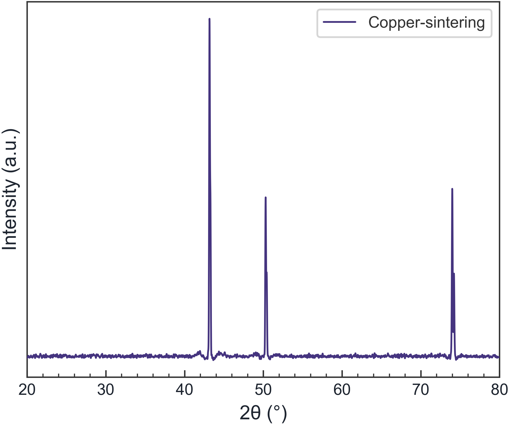
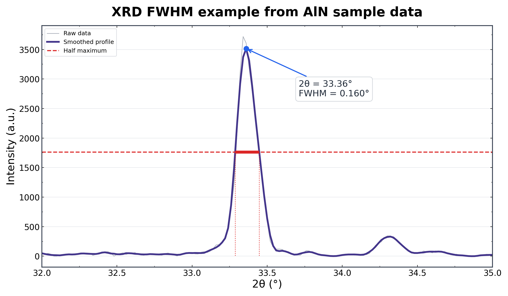
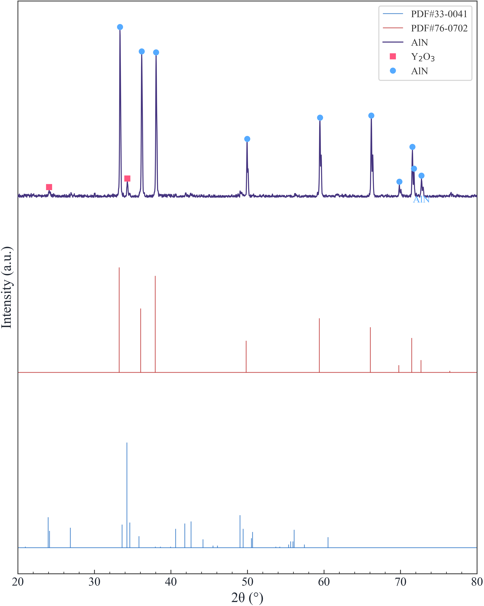

## What does XRD crystallite size actually measure?

In nanoparticle, powder, thin-film and catalyst research, X-ray diffraction (XRD) is often used to estimate a material's crystal size. The most common first-pass method is the **Scherrer equation**, which converts diffraction-peak broadening into an apparent size.

There is an important terminology point. The value obtained from peak broadening is more precisely the **crystallite size**, or coherent diffracting domain size. It is not necessarily the same as the particle size seen in an SEM image. One particle can contain several crystallites, so an XRD crystallite size smaller than an SEM particle diameter is not automatically a contradiction.

When the goal is to separate size broadening from microstrain, the next step is often a **Williamson–Hall plot**.



## The Scherrer equation and its parameters

The Scherrer equation is:

```text
D = Kλ / (β cos θ)
```

Where:

- `D` is the crystallite size, usually reported in nm or Å.
- `K` is the shape factor. A value near 0.9 is common, but the selected value should be stated.
- `λ` is the X-ray wavelength, such as 0.15406 nm for Cu Kα.
- `β` is the peak FWHM after background treatment, expressed in radians.
- `θ` is the Bragg angle, equal to half of the measured `2θ` position.

The most common calculation error is a unit error: **β must be in radians, not degrees, and λ must use the same length unit as D.**

## Worked calculation from 2θ and FWHM

Suppose one XRD peak has the following values:

- Peak position: `2θ = 38.18°`
- FWHM: `0.42°`
- X-ray source: Cu Kα, `λ = 1.5406 Å`
- Shape factor: `K = 0.9`

### 1. Calculate the Bragg angle

```text
θ = 38.18° / 2 = 19.09°
```

### 2. Convert FWHM from degrees to radians

```text
β = 0.42 × π / 180 = 0.00733 rad
```

### 3. Substitute into the Scherrer equation

```text
D = (0.9 × 1.5406) / (0.00733 × cos 19.09°)
  ≈ 200.2 Å
  ≈ 20.0 nm
```

The apparent crystallite size for this peak is therefore about **20.0 nm**.

In a real study, analyze several strong, well-resolved peaks rather than treating one peak as the entire sample. A partially merged peak can produce an artificially large FWHM, so overlapping peaks should be fitted individually whenever possible.



## Why Scherrer alone may not be enough

Peak broadening can come from more than crystallite size. Important sources include:

1. **Microstrain**: non-uniform lattice distortion from defects, doping, dislocations or thermal treatment.
2. **Instrumental broadening**: the optics, slits, source and detector add width unrelated to the sample.
3. **Peak overlap**: adjacent reflections can appear as one broad envelope.
4. **Background and baseline**: fluorescence or an amorphous contribution affects the measured width and area.

The Scherrer equation is useful for a rapid apparent-size estimate, but it does not automatically separate all of these effects.



## How to make a Williamson–Hall plot

A common Williamson–Hall relationship is:

```text
β cos θ = (Kλ / D) + 4ε sin θ
```

Plot `β cos θ` against `4 sin θ` for several reflections. In the linear model:

- The intercept is related to crystallite size `D`.
- The slope is related to microstrain `ε`.
- The regression `R²` helps you inspect whether the simple model is a reasonable description of the selected peaks.

Two peaks can define a line, but more well-resolved peaks generally provide a more defensible analysis. Williamson–Hall analysis is not a universal correction for every source of error; peak selection, instrumental broadening and FWHM quality still matter.

## Do the workflow without Python

If you do not want to measure every peak width manually in Excel, Origin or a custom Python script, **Spectra Studio** brings the common steps into one Windows workflow:

1. Load `.xrdml`, `.brml`, `.uxd`, `.txt`, `.xy`, `.csv` or `.dat` files.
2. Preview Savitzky–Golay smoothing and ALS baseline correction.
3. Run adjustable automatic peak detection.
4. In Pro, fit Gaussian, Lorentzian or mixed profiles and inspect position, FWHM, area, R² and residuals.
5. Open Crystallite Size to calculate Scherrer values for the detected or fitted peaks.
6. With two or more peaks, generate a Williamson–Hall plot with `D`, `ε` and `R²`.

The X-ray wavelength and shape factor are adjustable. Instrumental broadening is not automatically subtracted in the standard calculation, so a standard sample should be used for calibration when the peaks are close to the instrument resolution.

Spectra Studio runs on Windows 10/11 64-bit, processes data locally and does not require Python. The Free edition covers loading, smoothing, baseline correction, peak detection and watermark-free PNG/JPG output. Scherrer, Williamson–Hall, peak fitting and vector export are Pro features.

## Common questions

### Is XRD crystallite size the same as SEM particle size?

No. Scherrer analysis estimates a coherent diffracting domain size. An SEM particle can contain multiple crystallites, so the two measurements answer different questions.

### Can FWHM be entered in degrees?

Not directly in the Scherrer equation. Convert the FWHM to radians first. Forgetting this conversion is one of the most common XRD crystallite-size mistakes.

### How many peaks are needed for Williamson–Hall analysis?

Two peaks are the minimum for a line, but more high-quality, well-separated peaks are preferable. Do not add weak or strongly overlapping peaks only to increase the point count.

### Is there an XRD crystallite-size calculator without Python?

Spectra Studio is a Windows option that combines peak detection, peak fitting, Scherrer calculation and Williamson–Hall analysis in one interface.

## Final takeaway

The difficult part of XRD crystallite-size analysis is rarely the equation itself. Reliable results depend on trustworthy peak positions and FWHM values, sensible baseline treatment, and an honest discussion of instrumental broadening, microstrain and peak overlap. Use Scherrer for a clear first estimate, and use Williamson–Hall when you need to examine size and strain together.

👉 **Download Spectra Studio and start with the free edition:**
[See the Spectra Studio feature guide](../spectra-studio-guide-en/)
