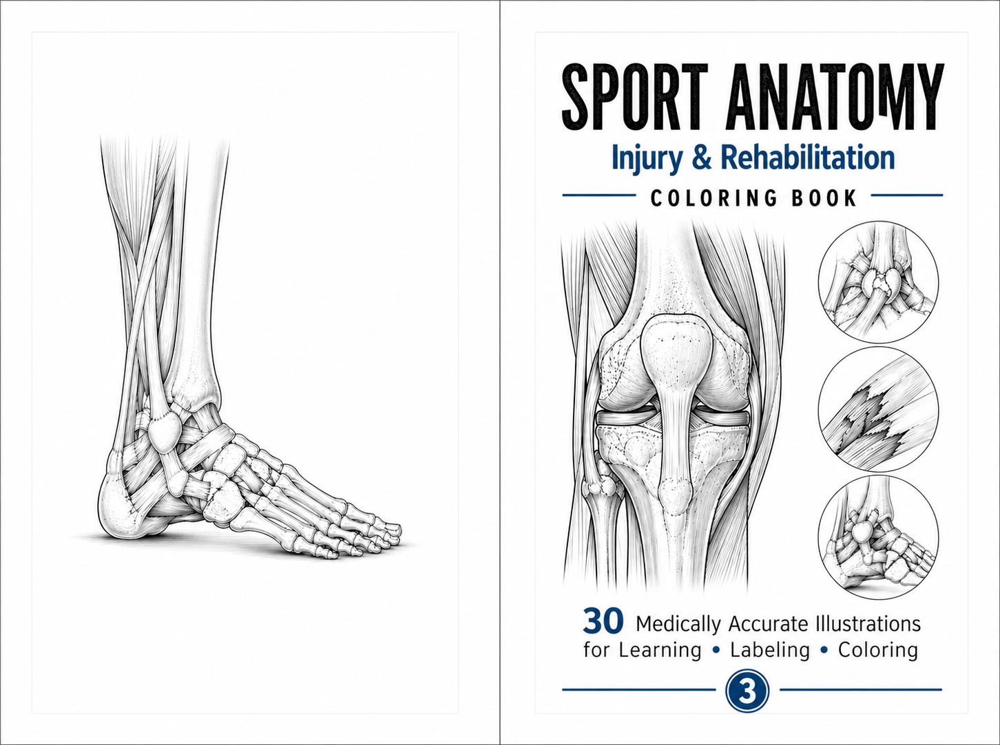
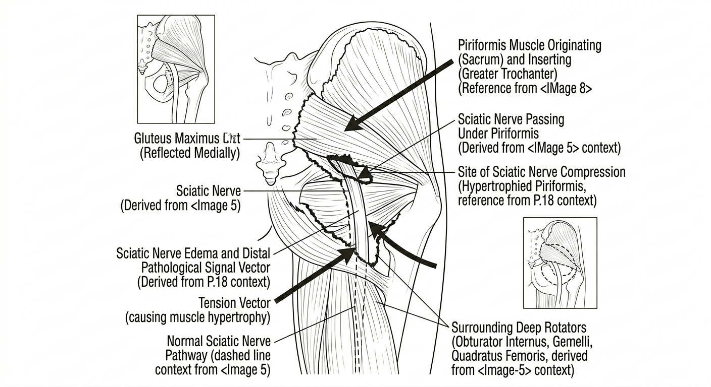
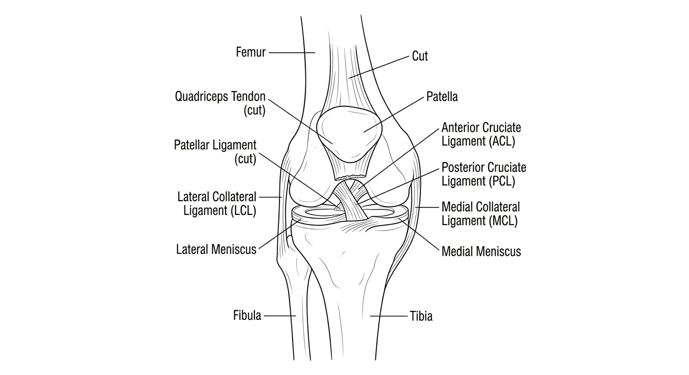
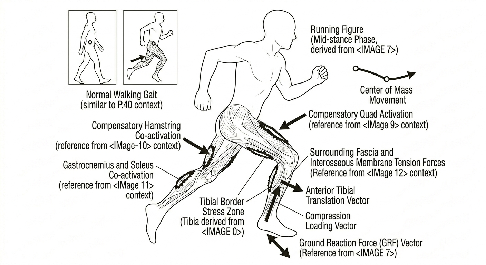
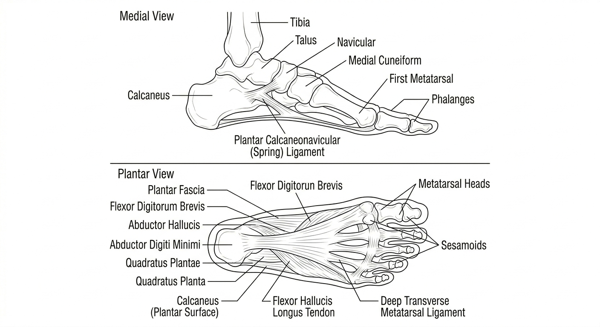

Ask any physiotherapy student, athletic trainer, or serious weekend athlete what the hardest part of learning anatomy is, and you'll rarely hear "there's too little information." Textbooks are thick, YouTube channels are endless, and every search engine will happily bury you in diagrams. The real problem is retention. You can read about the piriformis muscle fifteen times and still blank on where it attaches the moment a patient describes deep gluteal pain shooting down the leg. Anatomy isn't a knowledge problem. It's a memory problem, and memory responds to a very specific kind of effort.

That's the idea behind a study tool that looks almost too simple to work: the anatomy coloring book. Not the kind aimed at bored kids on a rainy afternoon, but a structured, clinically accurate workbook built for people who need this information to stick. Sports medicine students, physiotherapy undergraduates, coaches, and athletes recovering from their own injuries all fit that description. This guide walks through why sports anatomy is so hard to learn from prose alone, what makes its injury mechanisms tricky, and how a coloring-and-labeling format solves several learning problems at once.

## Reading Anatomy vs. *Doing* Anatomy

Most anatomy education leans on recognition, not recall. You look at a labeled diagram, read the paragraph beside it, nod, and move on. Recognition feels like learning because the answer is right there in front of you. But recognition and recall are different skills, and only recall helps in the moments that matter: a practical exam, a clinical assessment, a conversation with a coach about why a hamstring keeps re-tearing.

Cognitive science calls the gap between the two the "illusion of fluency." When information is presented cleanly, the brain mistakes ease of processing for depth of understanding. It's why students can highlight an entire chapter on knee ligaments, walk out of the library feeling confident, then freeze when asked to draw the ACL's femoral attachment from memory.

Active recall means retrieving information without looking at the source, and it is one of the most replicated findings in learning science. Testing yourself, even before you feel ready, produces far better long-term retention than rereading. The catch is that recall requires *friction*, a task that won't let you passively slide through it. Labeling a blank diagram is friction. Answering a fill-in-the-blank question before you're allowed to peek is friction. Coloring a muscle a set color while tracking its origin and insertion is friction too, a pleasant kind, but friction all the same.

That friction is what a good anatomy coloring book is built around. The coloring isn't the goal. The goal is holding your visual attention on one structure long enough for spatial memory to form, so you learn *where* something sits, not just what it's called.

## Why Sports Anatomy Rewards This Approach

General anatomy courses organize the body by system: skeletal, muscular, nervous, vascular. Sports anatomy and injury rehab don't work that way in practice. A single clinical question like "why does this runner's knee hurt at thirty degrees of flexion?" pulls in bone, ligament, tendon, nerve, and biomechanics at once. You can't understand iliotibial band syndrome by memorizing the IT band in isolation. You need to see it run from the iliac crest to Gerdy's tubercle, understand that it compresses a fat pad rather than sliding back and forth as older textbooks claimed, and tie that to a specific knee angle at a specific phase of the running gait cycle.

This is where integrated, injury-focused illustrations earn their keep. Instead of a clean isolated muscle, a good sports anatomy page shows the piriformis, the sciatic nerve, the surrounding deep rotators, and the greater trochanter attachment together, because that's how the syndrome presents. The visual complexity mirrors the clinical complexity. Mark a compression site, a tension vector, or a nerve pathway directly on the drawing, and the page teaches mechanism, not just nomenclature.

Piriformis syndrome makes the case, since it's one of the most commonly misdiagnosed conditions in sports medicine. The piriformis runs from the anterior sacrum to the greater trochanter, directly over the sciatic nerve. In about fifteen percent of people the nerve pierces straight through the muscle belly rather than passing beneath it, a variant that sharply raises compression risk. Read that sentence and you have a fact. Color the piriformis one color, the sciatic nerve a contrasting one, then trace the nerve's path beneath or through the muscle, and you have a mental model. The next time a runner describes deep gluteal pain that worsens with sitting and eases with walking, the classic tell that separates it from lumbar-origin sciatica, that model is what fires, not a flashcard.

## Learning Injuries as Mechanisms, Not Labels

The most valuable shift a coloring-and-labeling workbook makes is treating an injury as a *story*, not a *noun*. "ACL tear" is a noun. The clinical value is in the mechanism. About seventy percent of ACL injuries happen with no contact from another player, arising from the athlete's own landing, cutting, or pivoting. The ligament doesn't fail from one force. It fails when three converge: the knee near full extension, which cuts the hamstring's protective co-contraction; a valgus moment driving the knee inward; and internal rotation of the tibia that lets the tibial eminence press on the ligament. No single vector is enough. The combination crossing a critical threshold is what tears it.

Draw those force vectors onto a diagram and the concept lands in a way a paragraph never manages. When a page asks you to sketch the three non-contact ACL vectors onto a knee illustration yourself, you're not memorizing that valgus collapse is dangerous. You're building spatial intuition for *why* a given landing posture is dangerous. That's the understanding that changes coaching cues and warm-up design.

The same logic applies to popliteal artery entrapment syndrome (PAES), which is often missed because its presentation, exertional calf cramping that resolves with rest, overlaps with chronic exertional compartment syndrome. The difference is that PAES is vascular. An anomalous relationship between the popliteal artery and the medial gastrocnemius compresses the artery during active plantar flexion, and diagnosis relies on a specific drop in the ankle-brachial index during provocation testing. Grasping that means *seeing* the artery deviate around the muscle belly and where the compression sits relative to the normal path. A verbal description gets you partway. A colored diagram, with the artery in red, the deviated path marked apart from the normal one, and the compression zone shaded, gets you the rest of the way, because now you have a reference you built yourself.

## The Six-Step Study Loop

A coloring page on its own is just a nice picture. The structure wrapped around it is what turns it into a durable learning tool, and it's where a purpose-built workbook beats a generic printable pulled off the internet. A good sports anatomy workbook pairs every illustration with a knowledge page and follows a repeatable sequence:

1. **Scan first.** Before touching a pencil, read the page title, subtitle, and key structures list. Try to locate each structure on the illustration before applying any color. This one step prevents the classic failure of coloring books: mindless coloring with zero engagement.
2. **Color systematically.** Follow the color guide, working from deep structures to superficial ones. That order isn't arbitrary. It mirrors how structures appear in dissection and clinical palpation, and consistent color-coding across pages (arteries always red, veins always blue, nerves always yellow) builds a visual vocabulary that carries from page to page.
3. **Label from memory.** Fill in the blank label arrows before checking the key. This is the active recall step, and the one most people are tempted to skip. Don't. This is where the learning happens.
4. **Attempt the exercise without the guide.** Every page ends with a targeted question: name the four deep external hip rotators, identify which meniscus is more commonly injured and why, complete the NAVY mnemonic for the femoral triangle. These low-stakes self-tests reveal, immediately, whether the coloring produced understanding or just a nice-looking page.
5. **Read the clinical page.** Only now does the full prose explanation arrive, covering injury mechanism, prevention, rehab phases, and red flags. Because you've already built a visual foundation, the text lands differently. You're not decoding new vocabulary; you're adding depth to a structure you recognize.
6. **Return twenty-four hours later.** Almost nobody does this on their own, and it's the most important step. Spaced repetition, reviewing after a gap rather than immediately, is among the most robust findings in memory research. Re-labeling a page from memory a day later, without the key, roughly doubles long-term retention over single-session study.

None of these six steps is exotic. What makes them work is that they're built into the format, so you benefit without needing to know the learning science yourself. The structure does the work.

## Reading Rehab as a Timeline, Not a Snapshot

Good sports anatomy material treats rehabilitation as a *process with phases*, not a single "here's the treatment" line. Tissue healing follows a predictable biological timeline, and understanding that timeline is often more useful than memorizing any one protocol.

Take tendon and ligament healing. The inflammatory phase, the first several days after injury, handles hemostasis and recruits the cells that will do the repair. The proliferative phase, roughly day seven through day sixty, has fibroblasts laying down Type III collagen, which is flexible but far weaker than mature tissue. Only in the remodeling phase, which runs from two months out to as long as two years, does that immature collagen get replaced with cross-linked Type I collagen, aligned along the actual lines of stress the tissue sees. Even after two full years, a healed Achilles tendon typically retains only seventy to eighty percent of its original tensile strength.

Why does this matter? Because it explains the most common and costly mistake in sports rehab: returning to full activity based on how the athlete *feels* rather than where the tissue actually is. An athlete can be pain-free and moving confidently at three months while the tissue underneath is still early in remodeling, at half its eventual strength. That gap between clinical appearance and biological reality is the number one mechanism behind re-injury. A workbook that walks through inflammatory, proliferative, and remodeling phases as distinct, colorable stages, each with its own color, timeline, and loading guidelines, turns an abstract caution ("don't rush back") into a concrete model of *why* patience matters.

The same pattern runs through nearly every injury worth studying. Meniscal tears are managed completely differently by vascular zone: the outer red-red zone heals at roughly ninety percent after repair, while the avascular white-white zone essentially cannot heal and needs partial resection. Bone stress injuries progress along a four-grade, MRI-visible continuum from periosteal reaction to complete cortical fracture, and the key distinction isn't just severity. It's whether the fracture sits on the compression side of the bone, which usually responds to relative rest, or the tension side, the "dreaded black line" that carries a high nonunion risk and may need surgical fixation. These aren't details you can shortcut. They separate competent guidance from a well-meaning but dangerous recommendation.

## Recognizing the Moments That Matter: Red Flags

The single most valuable habit a sports anatomy resource can build isn't a fact at all. It's a reflex. Every injury category has a small set of presentations that mean not "manage conservatively and monitor" but "stop, refer, act now." Recognizing those moments fast matters more than memorizing any origin-insertion pair.

A few worth internalizing, because they recur across body regions:

- A sudden cold, pale, or pulseless limb after exercise signals acute arterial compromise, a limb-threatening emergency where irreversible ischemic damage can begin within about six hours. There is no room for wait-and-see.
- A knee that locks between ten and thirty degrees of flexion with a springy, rubbery end-feel, rather than a hard bony block, is the classic sign of a displaced bucket-handle meniscal tear needing urgent arthroscopy, since delay raises both cartilage damage and the odds the tissue is no longer repairable.
- Sudden, disproportionate pain after a tibial fracture, especially pain on passive stretch of the muscles in that limb, points to acute compartment syndrome, a true surgical emergency diagnosed clinically, without waiting for late signs like pulselessness.

Pairing every illustration with its red-flag list, right there on the same spread rather than buried in a separate chapter, builds the habit of scanning for danger as a normal part of thinking through any injury. That habit, more than any single fact, separates someone who has *studied* sports medicine from someone who can *practice* it safely.

## A Body-Region Walkthrough

To see why a workbook covering thirty topics beats a handful of generic diagrams, it helps to walk through what comprehensive regional coverage involves.

### Hip and Gluteal Region

This is where deep gluteal syndrome lives: piriformis syndrome and its differentials, proximal hamstring injuries from partial strains to full bony avulsions, and popliteal artery or common peroneal nerve involvement at the posterior knee. The value here is differentiation. Piriformis syndrome versus lumbar sciatica, vascular versus neurological calf pain, a hamstring strain versus an avulsion needing surgical reattachment. Illustrations that show normal and pathological anatomy side by side, a hypertrophied piriformis next to a normal one, do more for differential diagnosis than any single labeled diagram.

### Thigh and Quadriceps

Beyond muscle identification, this region is where biomechanical reasoning compounds. Consider why the rectus femoris, the only biarticular quadriceps head, is disproportionately prone to strain during kicking; why patellofemoral joint stress can exceed twenty times body weight in a jump landing; and why gluteus medius weakness, a hip problem, is often the root cause of a knee problem like IT band syndrome or patellofemoral pain. That proximal-to-distal reasoning is one of the harder conceptual leaps in sports medicine, and far easier when the illustration shows the whole kinetic chain rather than one muscle.

### The Knee Joint

This is arguably the highest-stakes region in sports medicine, given how much competitive time and long-term joint health ride on getting knee injuries right. The anterior, posterior, and lateral ligamentous anatomy has to become genuinely three-dimensional in the learner's mind. Not "the ACL is in the knee," but a working sense of how the anteromedial and posterolateral bundles behave differently through range of motion, how the posterolateral corner's three stabilizers each resist a distinct instability, and why isolated posterolateral corner injuries are so often missed on first assessment (up to half, by some estimates), leading to chronic instability.

### Lower Leg, Ankle, and Foot

This region rewards cross-sectional thinking. Know the four fascial compartments of the lower leg well enough to see why anterior compartment syndrome presents differently from the far more common (and far less dangerous) chronic exertional variety, and why the windlass mechanism linking toe dorsiflexion to plantar fascia tension explains both normal gait efficiency and the stretch protocol used for plantar fasciitis.

### Injury Pathology and Tissue Repair

The closing section ties the book together by focusing on process rather than structure: tear classification, healing-phase biology, gait mechanics under load, and the return-to-sport decisions that determine whether an athlete comes back stronger or comes back too early. It's deliberately last, because it only makes sense once the anatomy from every other chapter is in place.

## Who Gets the Most Out of It

The honest answer is broader than "anatomy students":

- **Sports medicine and physiotherapy students** get an engaging supplement that reinforces textbook learning through active recall instead of passive review, a different retrieval channel for anyone already buried in dense reading.
- **Athletic trainers and coaches** get real anatomical literacy without a formal degree, which pays off in clearer communication with medical staff and earlier recognition of warning signs.
- **Athletes** recovering from or trying to prevent a specific injury get something rarer: the ability to understand *their own* rehab program instead of blindly following instructions, which tends to improve both compliance and outcomes.
- **Self-directed learners** heading toward kinesiology, sports science, or allied health get a low-pressure, visual entry point into material that can otherwise feel intimidatingly dense.

Be clear about what this format is not. These are AI-generated anatomical illustrations built for educational coloring and labeling. They are useful for learning core structures and mechanisms, but they are not a replacement for a full anatomical atlas or for clinical guidelines in actual patient management. Treat the book as a structured, active-recall companion that sits alongside authoritative references, not a substitute for them.

## Why the Format Itself Is the Point

Coloring keeps showing up as an effective study technique for a reason, not just nostalgia. It occupies your hands and your visual attention at the same time in a way reading doesn't, crowding out the passive skimming that feeds the illusion-of-fluency trap. It forces a decision at every structure, namely what color and why, a small but real act of categorization that reading never demands. And because the finished page is an artifact you built rather than one you were handed, it's far more memorable during the twenty-four-hour review.

None of this replaces lecture, dissection, or clinical practice. But as a companion tool, one that turns commute time, waiting-room time, or an evening study block into genuine retrieval practice instead of another round of highlighting, a well-structured, clinically grounded coloring and labeling workbook fills a gap most anatomy resources ignore. The information in most textbooks is already accurate. What's usually missing is a format that makes it stick.

## Get the Book

If that six-step loop of scan, color, label, test, read, and revisit sounds worth building into your study routine, *Sport Anatomy: Injury & Rehabilitation Coloring Book* covers thirty medically oriented illustrations across the hip, thigh, knee, lower leg, ankle, and foot, each paired with a full clinical knowledge page:

> 📖 **[Sport Anatomy: Injury & Rehabilitation Coloring Book, available on Amazon →](https://www.amazon.com/dp/B0GYWP33WH)**
