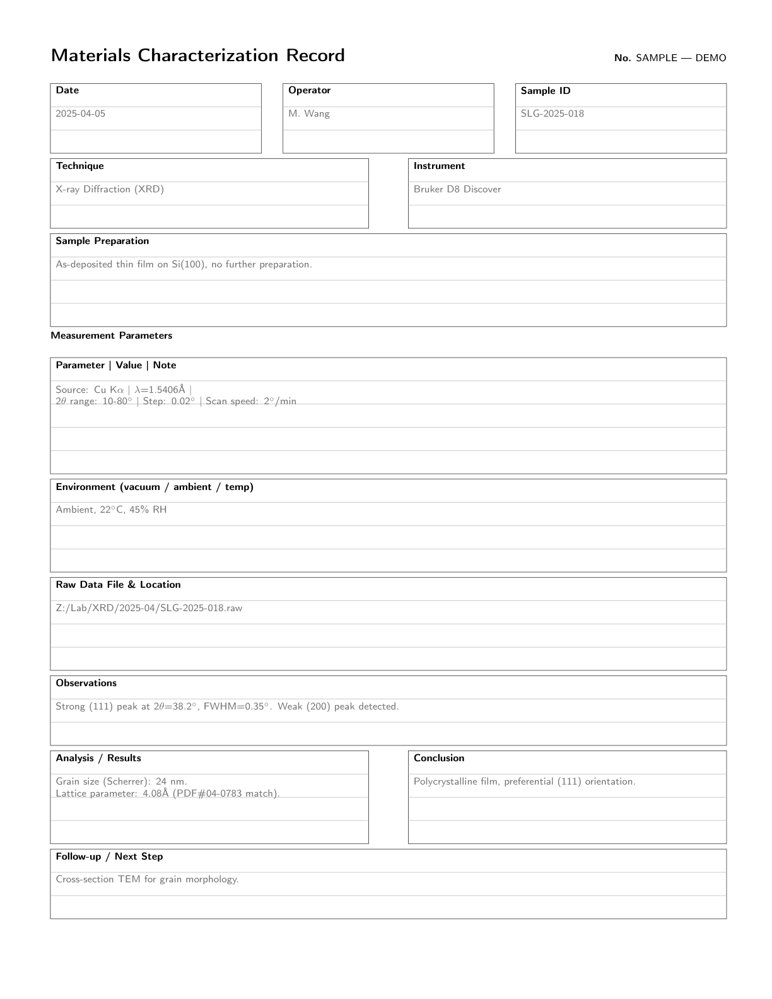
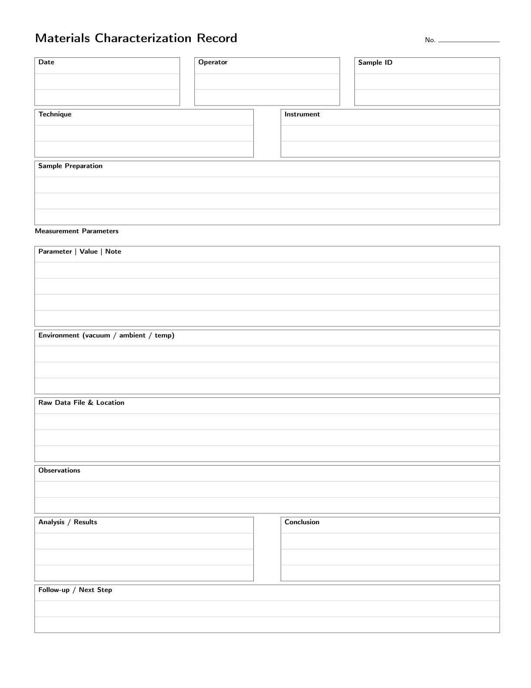

---
title: 'Why Your Characterization Data Needs a Better Home Than Scattered Files'
slug: 'materials-characterization-notebook'
description: 'XRD patterns, SEM images, DSC curves, and TGA data are only useful if you can find them later. A structured characterization lab notebook bridges the gap between instrument output and meaningful analysis.'
keywords: ['materials characterization', 'lab notebook', 'XRD analysis', 'SEM imaging', 'DSC TGA', 'materials testing notebook', 'characterization lab', 'engineering notebook']
author: 'Jerry Hu'
date: 2026-08-13
cover: ./materials-characterization-notebook-cover.png
category: 'reviews'
tags: ['KDP', 'Lab Notebook', 'Materials Characterization', 'Engineering']
locale: 'en'

draft: false
---

Materials characterization generates a specific kind of mess. The instruments produce digital files, but the context for those files lives in your head or in a scribbled note. That XRD pattern you ran last month, what were the scan parameters? That SEM image from three weeks ago, was that the sample with the longer annealing time or the higher temperature? These questions come up constantly in characterization work, and the answers are surprisingly hard to retrieve unless you have a system.

The default system for most researchers is a folder of instrument files with cryptic auto-generated names, plus a separate notebook for handwritten observations. The two never quite connect. You end up spending more time searching for information than analyzing it.

## The Connection Problem

Characterization is different from process work in one important way. In a process lab, the value is in the parameters you set. In a characterization lab, the value is in the relationship between the sample, the instrument settings, and the resulting data. You need to know not just what the SEM image shows, but what sample it came from, how that sample was prepared, what accelerating voltage was used, and whether the image is secondary electron or backscattered electron mode. That context is what makes the image interpretable.

Most researchers store the image file in one place and the context in another. The notebook that solves this problem provides a structured entry for each characterization session, with dedicated fields for the sample identifier, the preparation history, the instrument and its settings, and a place to affix or reference the resulting data. When everything is in one place, the analysis becomes faster and the conclusions are more reliable.

## Which Techniques Benefit Most

Some characterization techniques benefit more from structure than others. X-ray diffraction produces patterns that depend heavily on scan parameters. If you change the step size or the scan speed, the pattern changes. Recording those parameters alongside the sample information is essential for comparing results across sessions.

Scanning electron microscopy produces images that are easy to collect and easy to forget. The image file tells you what the microstructure looks like, but it does not tell you the working distance, the aperture size, or whether the image was taken in compositional or topographic mode. These details determine how you interpret the image. A lab notebook entry that captures them at the time of imaging eliminates the guesswork when you return to the data weeks later.

Thermal analysis techniques like DSC and TGA produce curves with features that need to be correlated with the sample history. A peak on a DSC curve might be a glass transition, a crystallization event, or a decomposition reaction. The sample's thermal history, heating rate, and atmosphere determine which interpretation is correct. Recording these alongside the curve prevents misinterpretation.

## The Format That Makes a Difference

The Materials Characterization Lab Notebook I published is built around the specific workflow of characterization work. Each entry starts with sample identification and preparation history, because those are the details most likely to be forgotten and most critical to interpretation. A dedicated instrument settings section covers the parameters for the most common characterization techniques: XRD, SEM, EDS, DSC, TGA, FTIR, and mechanical testing. There is a results summary section for recording key findings immediately, while the instrument is still running and the observations are fresh.

There is also a section for cross-referencing. Characterization data is often used to explain processing outcomes, and the notebook provides space to link each characterization entry to the corresponding process notebook entry. This cross-link is what turns a collection of instrument files into a coherent experimental record.

The book is not a guide to characterization techniques. It is a tool for organizing the data those techniques produce.

If you have ever spent an afternoon hunting for the settings behind a measurement you took last month, you already know why this structure matters.

> For a full characterization notebook with structured pages for XRD, SEM, DSC, and more, see [Materials Characterization Lab Notebook on Amazon](https://www.amazon.com/dp/B0H8M556H3).
