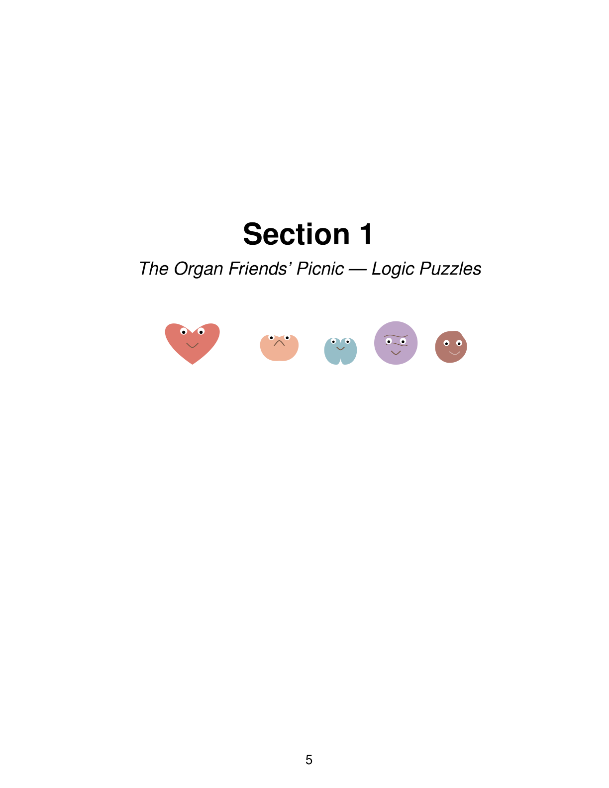
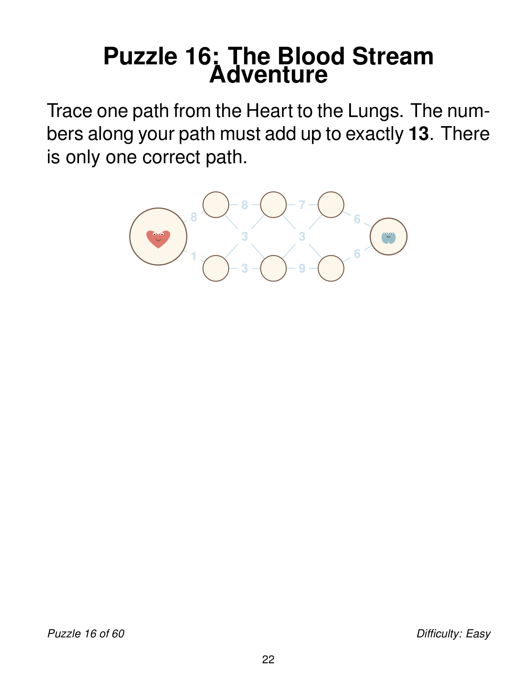
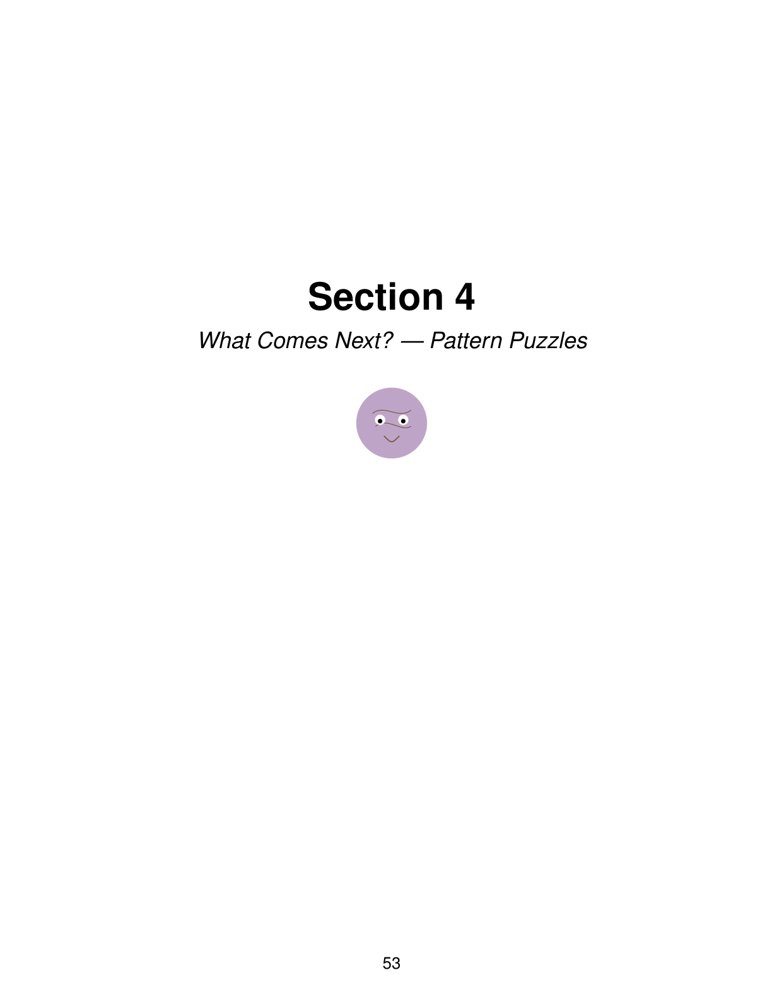

There are broadly two kinds of puzzle books. The first is the kind that demands serious concentration. Sudoku at the expert level, cryptic crosswords, math puzzles that make you reach for scratch paper. These are rewarding if you are in the mood, but they require a specific mental state that is not always available after a long day. The second kind is the activity book designed for children, which is engaging for about five minutes before the adult brain craves something with more substance.

Organ's Adventure sits in the gap between these two categories. It is a collection of sixty puzzles that are challenging enough to hold an adult's attention but gentle enough that you do not need to be fully caffeinated to attempt them. The theme is anatomical, with each puzzle tied to a different organ or body system, which gives the collection a coherence that most puzzle books lack.

## The Difficulty Sweet Spot

The design problem that puzzle books face is calibrating difficulty for a general audience. Too easy and the book gathers dust. Too hard and the book gathers dust after the first few pages. The author of Organ's Adventure has aimed for what I would call the Sunday morning sweet spot. The puzzles are engaging enough to make you think, but forgiving enough that you can complete most of them in a single sitting without frustration.

The variety helps. Word puzzles, visual patterns, logic chains, and simple ciphers rotate throughout the collection, so you are never doing the same type of puzzle for too long.

 The anatomical theme provides a subtle educational component. You might learn that the femur is the longest bone in the body while solving a word scramble, or that the liver has over five hundred functions while completing a matching exercise. The learning is incidental, which is exactly how it should be in a puzzle book. Nobody picks up a puzzle book to study. They pick it up to unwind, and the learning is a bonus.

## What Makes It Gentle

The gentleness of these puzzles comes from two design choices. First, the instructions are clear and consistent. Each puzzle type is introduced once, and the format stays the same throughout, so you never waste energy figuring out what you are supposed to do. Second, the puzzles are short. None of them overstays its welcome. You can complete one in five to ten minutes, feel a small sense of accomplishment, and put the book down without the nagging feeling that you left something unfinished.

This makes the book suitable for contexts where longer puzzle sessions are not practical. A commute, a coffee break, a few minutes before bed.

 The format respects your limited time and does not demand that you track your progress across multiple sessions.

## The Cognitive Argument

There is a reasonable body of research suggesting that regular engagement with novel mental challenges supports cognitive health as we age. The key word is novel. Doing the same crossword every day builds speed at crosswords but does not exercise broadly. A varied puzzle collection that rotates through different problem types provides the kind of diverse mental stimulation that the research points to.

Organ's Adventure covers a decent spread of cognitive domains. Verbal fluency from the word puzzles, visual-spatial reasoning from the pattern games, logical deduction from the chain puzzles.

 Sixty puzzles across these domains, done at a comfortable pace, provide a low-commitment way to keep the mind engaged without the pressure of a formal brain training program.

The book does not make grand claims about cognitive improvement. It is a puzzle book, not a medical intervention. But if the choice is between scrolling through social media for fifteen minutes and working through a gentle puzzle that makes you think, the puzzle is probably the better option.

## Who Would Enjoy It

The book is best suited for adults who want something more interesting than a word search but less demanding than a competitive crossword. It also works well as a shared activity. The puzzles are printable in the sense that multiple people can work on the same puzzle, and the gentle difficulty means nobody feels left out. Seniors looking for light cognitive engagement, adults who want a screen-free break, and anyone curious about the human body who wants a playful introduction will all find something to like here.

If your puzzle book collection currently consists of either children's activity books or dense logic puzzles that require an hour of commitment, Organ's Adventure fills the space between them comfortably.

> For a set of sixty gentle brain puzzles that teach a little anatomy along the way, see [Organ's Adventure on Amazon](https://www.amazon.com/dp/B0H8Q8H9LR).
