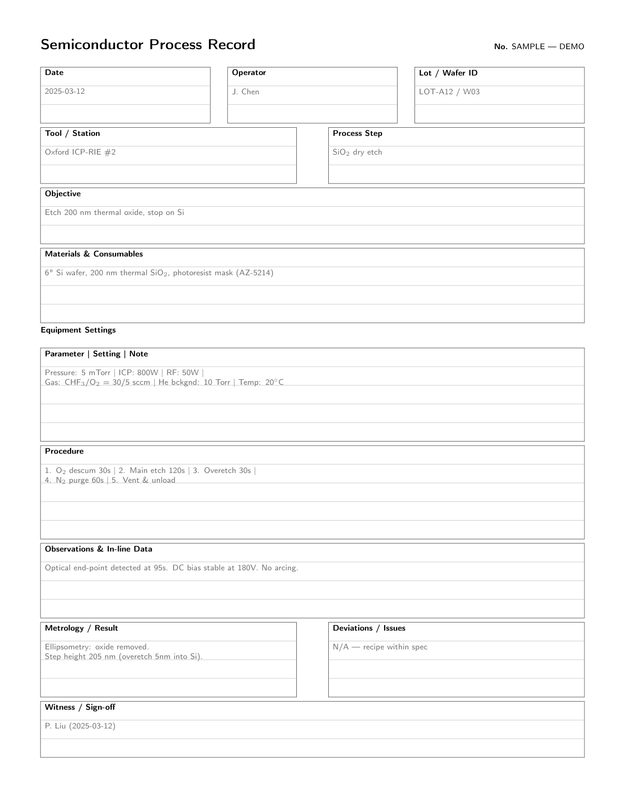

Ask any semiconductor process engineer about the worst mistake they have seen in a cleanroom, and the answer will probably involve a missing or incorrect log entry. A deposition recipe that ran at the wrong temperature because the previous user did not record a change. A lithography step that failed because the resist batch was not noted. A CMP polish that damaged a wafer because the pad conditioning history was unclear. The equipment itself is reliable. The human layer on top of it, the tracking of what was done, when, and under what conditions, is where things fall apart.

A lab notebook for semiconductor processing is not a diary of your work. It is a forensic document. If a process yields poorly six months from now, the first thing you will look for is the notebook entry from the last time that process ran well. If that entry is missing key parameters, you lose a week of troubleshooting time. If it does not exist at all, you lose more than that.

## What Makes Semiconductor Notebooks Different

Lab notebooks in biology or chemistry are primarily about recording observations. What did the gel show? What color did the solution turn? Semiconductor notebooks are primarily about recording parameters. Temperature, pressure, gas flow rate, RF power, exposure time, spin speed, bake temperature. The list is long and every parameter matters.

A semiconductor process is a chain of interdependent steps. Change the deposition temperature by five degrees and you change the film stress, which changes the lithography alignment, which changes the etch profile. The notebook that records all parameters for every step is the only way to trace a failure back to its root cause. This is why a structured, pre-formatted notebook is not a luxury. It is a tool that directly reduces the time between discovering a problem and fixing it.

## The Format That Works

Most engineers start with a blank notebook and develop their own logging style. This works for a few weeks, then the entries get shorter, then the critical details start getting left out. The notebook becomes a record of what you did, but not a complete enough record to be useful later.

A purpose-designed semiconductor lab notebook solves this by providing a structured format for each entry. Spaces for the date, the tool used, the process name, the target parameters, the actual parameters, and any deviations. A section for observations, for sketches of the wafer layout, for notes on what to try next. The format does the remembering for you. You fill in the blanks instead of deciding what to write, which means nothing gets omitted because you were tired or distracted.

The Semiconductor Process Lab Notebook I published follows exactly this structure. Each page is laid out with the fields a process engineer actually needs. There is a section for recording equipment calibration status, which is easy to forget and crucial for interpreting results. There is a dedicated area for recording defects or anomalies. And crucially, there is a process summary section at the end of each experiment that asks you to record the key takeaway while it is still fresh, rather than hoping you remember it next week.

## The Hidden Benefit

There is a secondary benefit to a structured notebook that you do not appreciate until you have been using one for a while. It makes your experimental reports faster to write. When every parameter is recorded in a consistent location, compiling the data for a report is just transcription. You do not have to reconstruct the conditions from memory or dig through scattered notes.

This matters more than it sounds. Process engineers spend a surprising fraction of their time writing reports and documenting results for manufacturing transfer. A notebook that feeds directly into that documentation process reduces one of the least rewarding parts of the job.

The notebook I designed is specifically built for semiconductor processing applications, with formats that cover deposition, lithography, etching, metrology, and packaging steps. If you work in a fab, a cleanroom, or a process development lab, it will save you time and protect you from the kind of mistakes that happen when your records are incomplete.

> For the full format and structure designed for semiconductor process engineers, see [Semiconductor Process Lab Notebook on Amazon](https://www.amazon.com/dp/B0H8M1CGC4).
