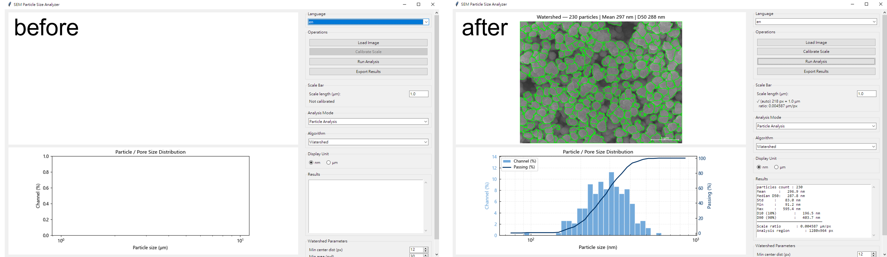
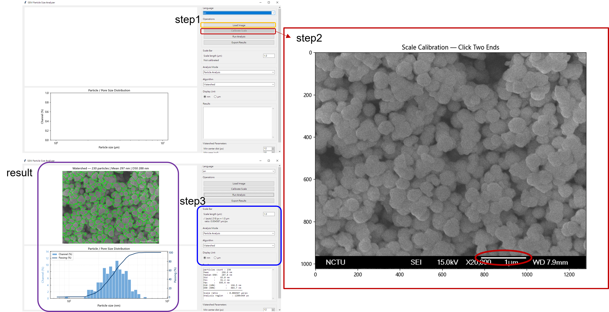
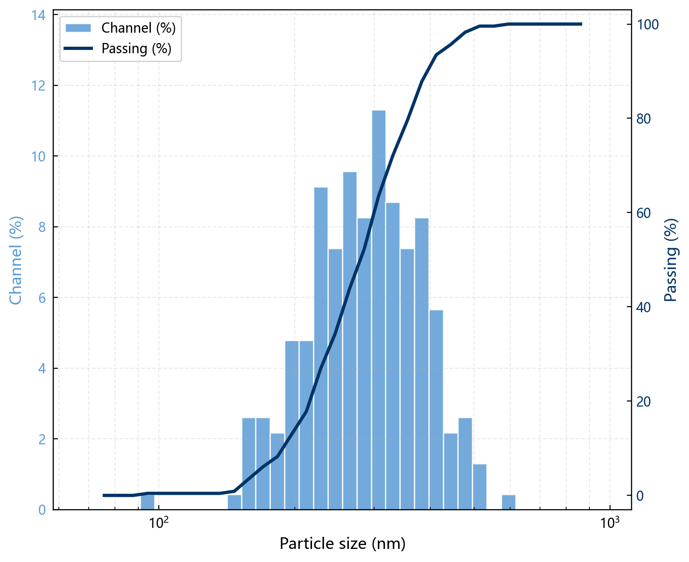

在材料研究與品管流程中，粒徑分布的量化是一項基礎且頻繁的工作。典型情況是：取得一張掃描式電子顯微鏡（SEM）影像後，需要回報平均粒徑、分布寬度，以及 D10、D50、D90 等特徵值。若以人工方式逐顆量測，不僅耗時，量測邊界的判定也會帶入操作者間的變異。本篇介紹的 SEM 粒徑分析工具，即針對此需求設計，目標是以一致的流程產出可重複的數據。



## 工具功能概述

工具讀入一張 SEM 影像（支援 TIF、PNG、JPG 等格式），自動辨識畫面中的顆粒或孔洞，量測其直徑，並輸出粒徑分布統計。整個流程不須以人工圈選，亦不依賴商業影像分析軟體的授權。

核心提供兩種分割演算法：

- Watershed（分水嶺）：適用於相互重疊、密集堆疊的顆粒。流程先進行對比增強，再以距離轉換求取各顆粒的種子點，最後將相連的顆粒切分開來。
- Hough Circle（霍夫圓）：適用於邊緣輪廓清晰的圓形顆粒，直接偵測圓心與半徑，量測精度較高。

除顆粒外，工具亦支援孔洞（pore）分析，切換至 pore 模式即可。這對電池極片、多孔陶瓷、薄膜等材料孔隙率的評估具有實質幫助。

## 所解決的問題

人工量測粒徑存在三項限制。其一為效率：單張影像往往包含數百顆粒，逐一量測相當費時。其二為客觀性：邊界與顆粒歸屬的判定因人而異，不同操作者得到的數值難以一致。其三為可重現性：間隔數月後，若未留存量測方法，原始數據即不易再次驗證。

工具將「如何量測」固化為一套既定流程。相同的影像輸入，無論由何人執行，皆能得到一致的結果。此特性對於論文數據的呈現、審稿意見的回覆，以及實驗室內部的數據交接，皆能提供實質助益。


## 適用場景

- 材料合成後的粒徑分布快速檢測：如奈米粉末、金屬顆粒、觸媒等。
- 薄膜或多孔材料的孔洞分析：粒徑與分布資訊是討論孔隙率與傳輸性質的基礎。
- 課程或專題報告：當學生未取得商業影像軟體授權時，此開源工具可直接使用。
- 多樣品批次處理：單一指令即可對整個資料夾進行分析，適合需要進行統計比較的情境。

## 安裝與準備

執行環境需 Python 3.8 以上。依賴套件安裝指令如下：

```bash
pip install opencv-python numpy pandas matplotlib scipy scikit-image pillow
```

若使用圖形介面，直接執行：

```bash
python particle_analyzer_gui.py
```



## 步驟一：比例尺校正

SEM 影像中的長度單位為像素，而分析目標通常為微米。因此校正為必要的前處理步驟，工具提供兩種方式：

互動式校正最為直覺。載入影像後，以滑鼠點選比例尺的兩端，再輸入該段距離所代表的實際微米數，工具即推算出 μm/pixel 換算比例。

自動偵測適用於批次作業。工具會嘗試自行定位影像中的比例尺，搭配 `--no-interactive` 參數，即可在不須人工介入的情況下處理整個資料夾。

若換算比例已知，亦可直接指定以略過校正：

```bash
python particle_analyzer.py sample.tif -m watershed -p 0.01
```

其中 `-p 0.01` 表示每像素相當於 0.01 微米。

## 步驟二：選擇演算法並分析

圖形介面經數次點擊即可完成分析。以下補充命令列用法，便於整合至腳本或排程作業：

```bash
# Watershed 分析（互動式校正比例尺）
python particle_analyzer.py sample.tif -m watershed

# Hough 圓形分析（直接指定比例尺長度）
python particle_analyzer.py sample.tif -m hough -r 1.0

# 非互動批次處理整個資料夾
python particle_analyzer.py *.tif -m watershed --no-interactive -l 1.0
```

參數說明：`-m` 指定 watershed 或 hough；`-r` 為比例尺實際長度（微米）；`-l` 則直接給定 μm/pixel。

常用微調參數如下：

- `--min-dist`：Watershed 中兩顆粒中心的最小距離（像素），預設 12，顆粒密集時可調大。
- `--min-area`：最小面積篩選，預設 30 像素平方，可用以濾除雜訊。
- `--hough-min-r` / `--hough-max-r`：Hough 圓的半徑上下限。
- `--param1` / `--param2`：Hough 的 Canny 高門檻與累加器門檻，預設分別為 50 與 30。



## 輸出結果

分析完成後，工具會於同一資料夾產出四個檔案：

- `*_diameters.csv`：各顆粒的直徑（微米），可供後續繪製箱型圖或進一步統計。
- `*_statistics.txt`：統計摘要，包含數量、平均、D10、D50、D90 等。其中 D50 為累積分布達 50% 時的粒徑，為學界報告數據時普遍採用。
- `*_overlay.png`：分割標註圖，標示各顆粒範圍與比例尺，可直接作為論文圖檔。
- `*_distribution.png`：雙軸對數分布圖，左軸為頻率（%），右軸為累積通過率曲線，可一眼判讀分布偏態。

## 實際應用

取得 D50 與分布寬度後，可進一步比較不同合成條件下的粒徑變化，例如溫度、添加劑、反應時間的影響。批次模式能一口氣處理數十張影像，將結果彙整後繪製趨勢圖，效率遠高於人工處理。

對於報告或教學用途，標註圖與分布圖皆為可直接引用的素材，無須再以其他軟體重繪。

## 效益與限制

此工具的效益在於免費、開源、可離線執行，且結果具可重現性；圖形介面與命令列兩種模式皆已完備，對未取得商業軟體授權的使用者尤具價值。

在限制方面，分割結果依賴影像對比品質。若 SEM 影像雜訊偏高，或顆粒與背景的灰階差異過小，量測準確度會受到影響，此時須回頭調整參數或先對影像進行前處理。此外，工具量測對象為二維投影，若須嚴格評估體積分布，仍應輔以其他方法。

## 小結

本工具將 SEM 影像的粒徑量化，由繁瑣的人工量測轉化為數道指令或數次點擊即可完成的標準流程。它不取代研究者對材料的判讀，但能將原本耗費於重複量測的時間，釋出以供更重要的分析工作。原始碼與執行檔皆置於 GitHub，歡迎取用與修改。
