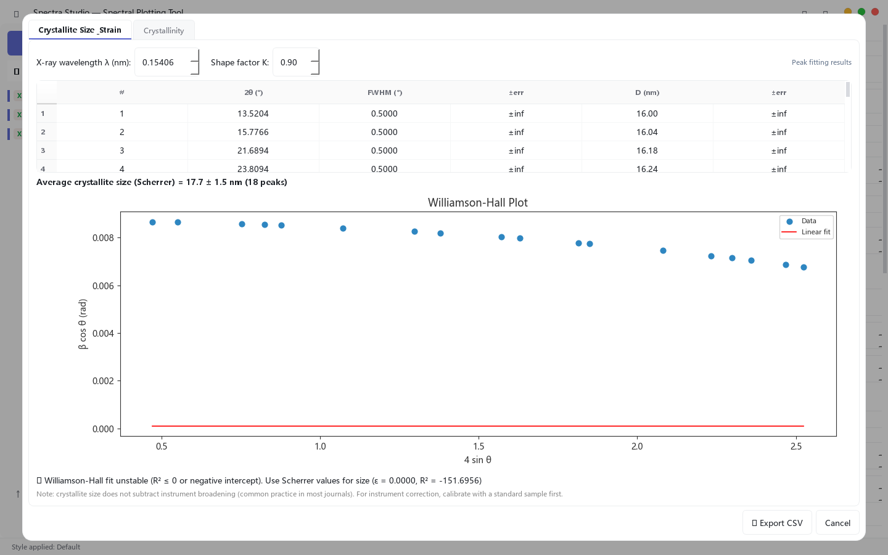

import { Image } from 'astro:assets';
import SpectraGalleryLightbox from '../../../../components/SpectraGalleryLightbox.astro';
import gallery01 from './gallery-01.png';
import gallery02 from './gallery-02.png';
import gallery03 from './gallery-03.png';
import gallery04 from './gallery-04.png';
import gallery05 from './gallery-05.png';
import gallery06 from './gallery-06.png';
import gallery07 from './gallery-07.png';
import gallery08 from './gallery-08.png';
import gallery09 from './gallery-09.png';
import gallery10 from './gallery-10.png';

<div style={{ display: 'flex', flexDirection: 'column', alignItems: 'center', textAlign: 'center', gap: '1.4rem', padding: '2.2rem 1rem 2.6rem', borderRadius: '16px', background: 'linear-gradient(160deg, rgba(91,141,239,0.10), rgba(91,141,239,0.03) 55%, transparent)', border: '1px solid rgba(91,141,239,0.22)' }}>

  <div style={{ fontSize: 'clamp(1.5rem, 1.1rem + 2.2vw, 2.3rem)', fontWeight: 700, lineHeight: 1.3, letterSpacing: '-0.01em', maxWidth: '900px' }}>
    把 XRD、FTIR、Raman 與 UV-Vis 數據變成可直接投稿的論文圖 —<br />不需要 Origin，也不需要 Python。
  </div>

  <div style={{ fontSize: '1.05rem', color: 'var(--color-text-secondary)', maxWidth: '760px', lineHeight: 1.7 }}>
    一款免費的 Windows 應用：直接讀取儀器檔、清理數據、擬合峰、匯出期刊樣式圖表。<strong>無浮水印、不用寫程式、免訂閱。</strong>
  </div>

  <div style={{ display: 'flex', flexWrap: 'wrap', justifyContent: 'center', gap: '0.8rem' }}>
    <a href="https://github.com/hujerry96/Web/releases/download/v2.1.4/SpectraStudio-Setup-v2.1.4.exe" style={{ display: 'inline-block', padding: '0.8rem 1.6rem', borderRadius: '10px', fontWeight: 600, color: '#fff', background: 'linear-gradient(135deg, var(--color-accent), var(--color-accent-dim))', boxShadow: '0 6px 24px var(--color-accent-glow)', textDecoration: 'none' }}>
      ⬇ 免費下載
    </a>
    <a href="#demo" style={{ display: 'inline-block', padding: '0.8rem 1.6rem', borderRadius: '10px', fontWeight: 600, color: 'var(--color-text)', border: '1px solid var(--color-border)', background: 'var(--color-surface)', textDecoration: 'none' }}>
      ▶ 看 30 秒示範
    </a>
  </div>

  <div style={{ display: 'flex', flexWrap: 'wrap', justifyContent: 'center', gap: '0.5rem 1.1rem', fontSize: '0.85rem', color: 'var(--color-text-secondary)' }}>
    <span>✅ Windows 10+（64 位元）</span>
    <span>✅ 安裝檔約 120 MB</span>
    <span>✅ 免 Python、無依賴</span>
    <span>✅ 數據全程留在本機</span>
  </div>

</div>

### 一條流程，一句話講完

<div style={{ display: 'flex', flexWrap: 'wrap', alignItems: 'center', justifyContent: 'center', gap: '0.9rem', margin: '0.4rem 0 1.2rem', padding: '1.1rem 1.4rem', borderRadius: '12px', border: '1px dashed var(--color-border)' }}>

  <div style={{ textAlign: 'center' }}>
    <div style={{ fontWeight: 700 }}>儀器數據</div>
    <div style={{ fontSize: '0.82rem', color: 'var(--color-text-secondary)' }}>.xrdml · .brml · .uxd · .asc<br />.xlsx / .csv / .xy / .txt</div>
  </div>

  <div style={{ color: 'var(--color-accent)', fontSize: '1.3rem', fontWeight: 700 }}>→</div>

  <div style={{ textAlign: 'center' }}>
    <div style={{ fontWeight: 700 }}>Spectra Studio</div>
    <div style={{ fontSize: '0.82rem', color: 'var(--color-text-secondary)' }}>平滑 · 基線 · 尋峰<br />擬合 · 分析 · 樣式</div>
  </div>

  <div style={{ color: 'var(--color-accent)', fontSize: '1.3rem', fontWeight: 700 }}>→</div>

  <div style={{ textAlign: 'center' }}>
    <div style={{ fontWeight: 700 }}>論文圖</div>
    <div style={{ fontSize: '0.82rem', color: 'var(--color-text-secondary)' }}>Nature / ACS / Elsevier<br />PNG · PDF · SVG · EPS · TIFF</div>
  </div>

</div>

## 成品展示：畫出來長這樣

以下 10 張全部來自你提供的繪圖成品範例，採 responsive masonry 拼貼排版：

<div data-spectra-gallery="true" style={{ columns: '3 260px', columnGap: '0.9rem', margin: '1rem 0 1.5rem' }}>
  <figure style={{ breakInside: 'avoid', margin: '0 0 0.9rem', borderRadius: '12px', overflow: 'hidden', border: '1px solid var(--color-border)', background: '#fff', boxShadow: '0 6px 20px rgba(15,23,42,0.08)' }}>
    <div style={{ position: 'relative', background: '#fff' }}>
      <Image src={gallery01} alt="真實匯出成品 01 from Spectra Studio" style={{ width: '100%', height: 'auto', display: 'block' }} />
      <span style={{ position: 'absolute', top: '0.55rem', left: '0.55rem', padding: '0.2rem 0.45rem', borderRadius: '999px', background: 'rgba(15,23,42,0.78)', color: '#fff', fontSize: '0.72rem', fontWeight: 700, letterSpacing: '0.04em' }}>01</span>
    </div>
    <figcaption style={{ padding: '0.5rem 0.7rem', fontSize: '0.78rem', color: 'var(--color-text-secondary)' }}>成品 01</figcaption>
  </figure>
  <figure style={{ breakInside: 'avoid', margin: '0 0 0.9rem', borderRadius: '12px', overflow: 'hidden', border: '1px solid var(--color-border)', background: '#fff', boxShadow: '0 6px 20px rgba(15,23,42,0.08)' }}>
    <div style={{ position: 'relative', background: '#fff' }}>
      <Image src={gallery02} alt="真實匯出成品 02 from Spectra Studio" style={{ width: '100%', height: 'auto', display: 'block' }} />
      <span style={{ position: 'absolute', top: '0.55rem', left: '0.55rem', padding: '0.2rem 0.45rem', borderRadius: '999px', background: 'rgba(15,23,42,0.78)', color: '#fff', fontSize: '0.72rem', fontWeight: 700, letterSpacing: '0.04em' }}>02</span>
    </div>
    <figcaption style={{ padding: '0.5rem 0.7rem', fontSize: '0.78rem', color: 'var(--color-text-secondary)' }}>成品 02</figcaption>
  </figure>
  <figure style={{ breakInside: 'avoid', margin: '0 0 0.9rem', borderRadius: '12px', overflow: 'hidden', border: '1px solid var(--color-border)', background: '#fff', boxShadow: '0 6px 20px rgba(15,23,42,0.08)' }}>
    <div style={{ position: 'relative', background: '#fff' }}>
      <Image src={gallery03} alt="真實匯出成品 03 from Spectra Studio" style={{ width: '100%', height: 'auto', display: 'block' }} />
      <span style={{ position: 'absolute', top: '0.55rem', left: '0.55rem', padding: '0.2rem 0.45rem', borderRadius: '999px', background: 'rgba(15,23,42,0.78)', color: '#fff', fontSize: '0.72rem', fontWeight: 700, letterSpacing: '0.04em' }}>03</span>
    </div>
    <figcaption style={{ padding: '0.5rem 0.7rem', fontSize: '0.78rem', color: 'var(--color-text-secondary)' }}>成品 03</figcaption>
  </figure>
  <figure style={{ breakInside: 'avoid', margin: '0 0 0.9rem', borderRadius: '12px', overflow: 'hidden', border: '1px solid var(--color-border)', background: '#fff', boxShadow: '0 6px 20px rgba(15,23,42,0.08)' }}>
    <div style={{ position: 'relative', background: '#fff' }}>
      <Image src={gallery04} alt="真實匯出成品 04 from Spectra Studio" style={{ width: '100%', height: 'auto', display: 'block' }} />
      <span style={{ position: 'absolute', top: '0.55rem', left: '0.55rem', padding: '0.2rem 0.45rem', borderRadius: '999px', background: 'rgba(15,23,42,0.78)', color: '#fff', fontSize: '0.72rem', fontWeight: 700, letterSpacing: '0.04em' }}>04</span>
    </div>
    <figcaption style={{ padding: '0.5rem 0.7rem', fontSize: '0.78rem', color: 'var(--color-text-secondary)' }}>成品 04</figcaption>
  </figure>
  <figure style={{ breakInside: 'avoid', margin: '0 0 0.9rem', borderRadius: '12px', overflow: 'hidden', border: '1px solid var(--color-border)', background: '#fff', boxShadow: '0 6px 20px rgba(15,23,42,0.08)' }}>
    <div style={{ position: 'relative', background: '#fff' }}>
      <Image src={gallery05} alt="真實匯出成品 05 from Spectra Studio" style={{ width: '100%', height: 'auto', display: 'block' }} />
      <span style={{ position: 'absolute', top: '0.55rem', left: '0.55rem', padding: '0.2rem 0.45rem', borderRadius: '999px', background: 'rgba(15,23,42,0.78)', color: '#fff', fontSize: '0.72rem', fontWeight: 700, letterSpacing: '0.04em' }}>05</span>
    </div>
    <figcaption style={{ padding: '0.5rem 0.7rem', fontSize: '0.78rem', color: 'var(--color-text-secondary)' }}>成品 05</figcaption>
  </figure>
  <figure style={{ breakInside: 'avoid', margin: '0 0 0.9rem', borderRadius: '12px', overflow: 'hidden', border: '1px solid var(--color-border)', background: '#fff', boxShadow: '0 6px 20px rgba(15,23,42,0.08)' }}>
    <div style={{ position: 'relative', background: '#fff' }}>
      <Image src={gallery06} alt="真實匯出成品 06 from Spectra Studio" style={{ width: '100%', height: 'auto', display: 'block' }} />
      <span style={{ position: 'absolute', top: '0.55rem', left: '0.55rem', padding: '0.2rem 0.45rem', borderRadius: '999px', background: 'rgba(15,23,42,0.78)', color: '#fff', fontSize: '0.72rem', fontWeight: 700, letterSpacing: '0.04em' }}>06</span>
    </div>
    <figcaption style={{ padding: '0.5rem 0.7rem', fontSize: '0.78rem', color: 'var(--color-text-secondary)' }}>成品 06</figcaption>
  </figure>
  <figure style={{ breakInside: 'avoid', margin: '0 0 0.9rem', borderRadius: '12px', overflow: 'hidden', border: '1px solid var(--color-border)', background: '#fff', boxShadow: '0 6px 20px rgba(15,23,42,0.08)' }}>
    <div style={{ position: 'relative', background: '#fff' }}>
      <Image src={gallery07} alt="真實匯出成品 07 from Spectra Studio" style={{ width: '100%', height: 'auto', display: 'block' }} />
      <span style={{ position: 'absolute', top: '0.55rem', left: '0.55rem', padding: '0.2rem 0.45rem', borderRadius: '999px', background: 'rgba(15,23,42,0.78)', color: '#fff', fontSize: '0.72rem', fontWeight: 700, letterSpacing: '0.04em' }}>07</span>
    </div>
    <figcaption style={{ padding: '0.5rem 0.7rem', fontSize: '0.78rem', color: 'var(--color-text-secondary)' }}>成品 07</figcaption>
  </figure>
  <figure style={{ breakInside: 'avoid', margin: '0 0 0.9rem', borderRadius: '12px', overflow: 'hidden', border: '1px solid var(--color-border)', background: '#fff', boxShadow: '0 6px 20px rgba(15,23,42,0.08)' }}>
    <div style={{ position: 'relative', background: '#fff' }}>
      <Image src={gallery08} alt="真實匯出成品 08 from Spectra Studio" style={{ width: '100%', height: 'auto', display: 'block' }} />
      <span style={{ position: 'absolute', top: '0.55rem', left: '0.55rem', padding: '0.2rem 0.45rem', borderRadius: '999px', background: 'rgba(15,23,42,0.78)', color: '#fff', fontSize: '0.72rem', fontWeight: 700, letterSpacing: '0.04em' }}>08</span>
    </div>
    <figcaption style={{ padding: '0.5rem 0.7rem', fontSize: '0.78rem', color: 'var(--color-text-secondary)' }}>成品 08</figcaption>
  </figure>
  <figure style={{ breakInside: 'avoid', margin: '0 0 0.9rem', borderRadius: '12px', overflow: 'hidden', border: '1px solid var(--color-border)', background: '#fff', boxShadow: '0 6px 20px rgba(15,23,42,0.08)' }}>
    <div style={{ position: 'relative', background: '#fff' }}>
      <Image src={gallery09} alt="真實匯出成品 09 from Spectra Studio" style={{ width: '100%', height: 'auto', display: 'block' }} />
      <span style={{ position: 'absolute', top: '0.55rem', left: '0.55rem', padding: '0.2rem 0.45rem', borderRadius: '999px', background: 'rgba(15,23,42,0.78)', color: '#fff', fontSize: '0.72rem', fontWeight: 700, letterSpacing: '0.04em' }}>09</span>
    </div>
    <figcaption style={{ padding: '0.5rem 0.7rem', fontSize: '0.78rem', color: 'var(--color-text-secondary)' }}>成品 09</figcaption>
  </figure>
  <figure style={{ breakInside: 'avoid', margin: '0 0 0.9rem', borderRadius: '12px', overflow: 'hidden', border: '1px solid var(--color-border)', background: '#fff', boxShadow: '0 6px 20px rgba(15,23,42,0.08)' }}>
    <div style={{ position: 'relative', background: '#fff' }}>
      <Image src={gallery10} alt="真實匯出成品 10 from Spectra Studio" style={{ width: '100%', height: 'auto', display: 'block' }} />
      <span style={{ position: 'absolute', top: '0.55rem', left: '0.55rem', padding: '0.2rem 0.45rem', borderRadius: '999px', background: 'rgba(15,23,42,0.78)', color: '#fff', fontSize: '0.72rem', fontWeight: 700, letterSpacing: '0.04em' }}>10</span>
    </div>
    <figcaption style={{ padding: '0.5rem 0.7rem', fontSize: '0.78rem', color: 'var(--color-text-secondary)' }}>成品 10</figcaption>
  </figure>
</div>

<SpectraGalleryLightbox />

## 🎬 30 秒示範

<a id="demo"></a>

<video controls preload="none" poster={`${import.meta.env.BASE_URL.replace(/\/$/, '')}/videos/spectra-studio-promo-poster.jpg`} style={{ width: '100%', borderRadius: '12px', border: '1px solid var(--color-border)', background: '#000' }}>
  <source src={`${import.meta.env.BASE_URL.replace(/\/$/, '')}/videos/spectra-studio-promo.mp4`} type="video/mp4" />
  您的瀏覽器不支援影片播放，可直接<a href={`${import.meta.env.BASE_URL.replace(/\/$/, '')}/videos/spectra-studio-promo.mp4`}>下載影片</a>。
</video>

## 免費版就有這些功能

下載安裝的這一份程式，就是完整版——**免費版功能全部立即可用**（$0、無限期、無浮水印）；Pro 功能也已經內建在同一個安裝檔裡，購買金鑰後立即解鎖，不需要重新下載任何東西。

- **數據載入**：儀器原生檔直接讀取——PANalytical（.xrdml）、Bruker（.brml）、通用 .uxd，以及 .txt / .xy / .csv / .dat、FTIR（.asc）、**UV-Vis（波長 nm 自動偵測）**、DSC/TGA（Excel .xlsx / .xls）
- **多筆數據管理**：同時顯示、堆疊、歸一化、垂直偏移、批次上色
- **預處理**：Savitzky-Golay 平滑、ALS 基線校正——每次調整都即時預覽
- **峰值分析**：自動尋峰（高度/形狀判斷，靈敏度可調）
- **期刊繪圖樣式**：Nature / ACS / Elsevier 一鍵切換、圖例與刻度細調
- **匯出**：PNG / JPG（最高 300 DPI），無浮水印，可自由用於論文與報告


## 為什麼研究者要升級 Pro

下面這些步驟正是吃掉你晚上的東西——而 Pro 把它們壓縮成幾秒鐘。四支實機操作，直接看：

<div style={{ display: 'grid', gridTemplateColumns: 'repeat(auto-fit, minmax(320px, 1fr))', gap: '1.1rem', margin: '1.2rem 0' }}>

  <div style={{ borderRadius: '12px', overflow: 'hidden', border: '1px solid var(--color-border)', background: 'var(--color-surface)' }}>
    <video autoPlay muted loop playsInline preload="metadata" style={{ width: '100%', display: 'block', background: '#000' }}>
      <source src={`${import.meta.env.BASE_URL.replace(/\/$/, '')}/videos/spectra-demo-fit.mp4`} type="video/mp4" />
    </video>
    <div style={{ padding: '0.85rem 1rem' }}>
      <div style={{ fontWeight: 700 }}>分峰擬合 <span style={{ fontSize: '0.72rem', fontWeight: 600, color: 'var(--color-accent)', border: '1px solid var(--color-accent)', borderRadius: '999px', padding: '0.1rem 0.5rem', marginLeft: '0.3rem', verticalAlign: 'middle' }}>PRO</span></div>
      <div style={{ fontSize: '0.9rem', color: 'var(--color-text-secondary)', marginTop: '0.3rem' }}>Gaussian / Lorentzian / 混合峰型，以自動尋峰結果為初始值。位置、FWHM、面積、<strong>R² 與殘差</strong>一張表輸出——直接貼進補充材料。</div>
    </div>
  </div>

  <div style={{ borderRadius: '12px', overflow: 'hidden', border: '1px solid var(--color-border)', background: 'var(--color-surface)' }}>
    <video autoPlay muted loop playsInline preload="metadata" style={{ width: '100%', display: 'block', background: '#000' }}>
      <source src={`${import.meta.env.BASE_URL.replace(/\/$/, '')}/videos/spectra-demo-grain.mp4`} type="video/mp4" />
    </video>
    <div style={{ padding: '0.85rem 1rem' }}>
      <div style={{ fontWeight: 700 }}>晶粒尺寸與微應變 <span style={{ fontSize: '0.72rem', fontWeight: 600, color: 'var(--color-accent)', border: '1px solid var(--color-accent)', borderRadius: '999px', padding: '0.1rem 0.5rem', marginLeft: '0.3rem', verticalAlign: 'middle' }}>PRO</span></div>
      <div style={{ fontSize: '0.9rem', color: 'var(--color-text-secondary)', marginTop: '0.3rem' }}>每個峰用 Scherrer D = Kλ/βcosθ 算晶粒尺寸，再自動畫 Williamson–Hall 圖，輸出 <strong>D、ε 與 R²</strong>。XRD 檔 → 點一下 → 審稿人會問的數字。</div>
    </div>
  </div>

  <div style={{ borderRadius: '12px', overflow: 'hidden', border: '1px solid var(--color-border)', background: 'var(--color-surface)' }}>
    <video autoPlay muted loop playsInline preload="metadata" style={{ width: '100%', display: 'block', background: '#000' }}>
      <source src={`${import.meta.env.BASE_URL.replace(/\/$/, '')}/videos/spectra-demo-miller.mp4`} type="video/mp4" />
    </video>
    <div style={{ padding: '0.85rem 1rem' }}>
      <div style={{ fontWeight: 700 }}>相位比對與 Miller 指數 <span style={{ fontSize: '0.72rem', fontWeight: 600, color: 'var(--color-accent)', border: '1px solid var(--color-accent)', borderRadius: '999px', padding: '0.1rem 0.5rem', marginLeft: '0.3rem', verticalAlign: 'middle' }}>PRO</span></div>
      <div style={{ fontSize: '0.9rem', color: 'var(--color-text-secondary)', marginTop: '0.3rem' }}>樣品峰與 PDF 參考卡比對，<strong>(hkl) 標註直接畫在峰上</strong>。「這是 α 相還是 β 相？」——幾秒鐘有答案。</div>
    </div>
  </div>

  <div style={{ borderRadius: '12px', overflow: 'hidden', border: '1px solid var(--color-border)', background: 'var(--color-surface)' }}>
    <video autoPlay muted loop playsInline preload="metadata" style={{ width: '100%', display: 'block', background: '#000' }}>
      <source src={`${import.meta.env.BASE_URL.replace(/\/$/, '')}/videos/spectra-demo-export.mp4`} type="video/mp4" />
    </video>
    <div style={{ padding: '0.85rem 1rem' }}>
      <div style={{ fontWeight: 700 }}>向量格式匯出 <span style={{ fontSize: '0.72rem', fontWeight: 600, color: 'var(--color-accent)', border: '1px solid var(--color-accent)', borderRadius: '999px', padding: '0.1rem 0.5rem', marginLeft: '0.3rem', verticalAlign: 'middle' }}>PRO</span></div>
      <div style={{ fontSize: '0.9rem', color: 'var(--color-text-secondary)', marginTop: '0.3rem' }}><strong>PDF · SVG · EPS · TIFF</strong>（最高 600 DPI）——向量圖直接進稿件，任意縮放都清晰。不用截圖、不用重畫。</div>
    </div>
  </div>

</div>

**Pro 還有 Tauc 能隙分析（UV-Vis）：**載入吸收度數據，按「Tauc Bandgap」，直接 (αhν)² / 間接 (αhν)^½ 一鍵切換，線性區自動偵測並畫切線——**Eg 與對應波長直接標註在圖上**（自動精度約 ±0.1 eV）。可選膜厚轉換 α = 2.303A/d；留空則用相對 α，**能隙值不受影響**。

> 💡 **大家實際在跑的流程**：載入 → 平滑/去基線 → 自動尋峰 → 擬合 → Scherrer / Williamson–Hall → Miller 標相 → 向量匯出。在 Origin 或 Python 腳本裡這是半個下午；在 Spectra Studio 裡，這只是 UI 的自然順序。

## 🎬 55 秒功能導覽

想一次看完整個工作流程？

<video controls preload="none" poster={`${import.meta.env.BASE_URL.replace(/\/$/, '')}/videos/spectra-studio-tour-poster.jpg`} style={{ width: '100%', borderRadius: '12px', border: '1px solid var(--color-border)', background: '#000' }}>
  <source src={`${import.meta.env.BASE_URL.replace(/\/$/, '')}/videos/spectra-studio-tour.mp4`} type="video/mp4" />
  您的瀏覽器不支援影片播放，可直接<a href={`${import.meta.env.BASE_URL.replace(/\/$/, '')}/videos/spectra-studio-tour.mp4`}>下載影片</a>。
</video>

## 一步一步：10 分鐘做一張論文圖

下面以「六組 CO3Ap（碳酸鈣磷灰石）XRD 樣品 → ACS 期刊樣式投稿圖」為例，走完整個流程。

### Step 1：載入數據

按「載入數據」選檔（或直接把檔案拖進視窗）。多檔同時載入——左側樣品清單自動填入，曲線立即顯示。堆疊、歸一化、垂直偏移讓多樣品比較一目了然。


### Step 2：預處理（平滑 + 基線）

在預處理面板調整平滑視窗（Savitzky-Golay）與基線參數（ALS）——**每次調整都即時預覽**。典型流程：平滑視窗 9–15 去除雜訊，再做基線校正把背景壓平。


### Step 3：自動尋峰

按「自動尋峰」，工具依高度與形狀標出候選峰（靈敏度可調）。偵測到的峰同時出現在表格與圖上，立刻可以檢查。


### Step 4：分峰擬合（Pro）

遇到重疊峰就用分峰擬合：工具以尋峰結果當初始值，擬合 Gaussian / Lorentzian（或混合）峰型，輸出每個峰的**位置、FWHM、面積、R² 與殘差**——結果表可直接貼進補充材料。


### Step 5：套用期刊樣式

Nature / ACS / Elsevier 一鍵切換；圖例位置、字型、線寬、刻度方向皆可細調。Pro 額外支援 Miller 指數與相位比對標註。


### Step 6：匯出

先預覽再存檔，接著選格式與解析度。PNG / JPG 最高 300 DPI；Pro 解鎖 PDF / SVG / EPS / TIFF 向量匯出與更高解析度——投稿圖就從這裡出去。


## 晶粒大小分析（Pro）：晶粒尺寸、結晶度、Tauc 能隙

審稿人最常要的三個數字——晶粒尺寸、結晶度、能隙——v2.1 起一鍵算完，不再需要手動 Excel 或 Origin。

### 晶粒尺寸與微應變（Scherrer / Williamson-Hall）



v2.1.1 起不再需要先做分峰擬合——峰來源自動降級：①擬合結果 → ②自動尋峰結果 → ③對話框內一鍵尋峰。你也可以先跑 Step 4 的分峰擬合，再按「晶粒尺寸」。它會：

- 用 **Scherrer 方程式 D = Kλ/(βcosθ)** 算出每個擬合峰的晶粒尺寸，含誤差傳遞，一張結果表輸出

> 第一次算？先讀[如何從 XRD 計算晶粒尺寸（Scherrer 與 Williamson–Hall，含範例）](${import.meta.env.BASE_URL}/en/guides/how-to-calculate-crystallite-size-from-xrd/)或直接用[互動式 Scherrer 計算器](${import.meta.env.BASE_URL}/zh/tools/crystallite-size-calculator/)——學會之後，讓軟體一鍵完成。

- 有 2 個峰以上自動畫 **Williamson–Hall 圖**（βcosθ vs 4sinθ）；加權線性擬合輸出**晶粒尺寸 D、微應變 ε 與 R²**——審稿人最愛問的「尺寸 vs 應變」，30 秒回答
- X 光波長（預設 Cu Kα = 0.15406 nm）與形狀因子 K 都可調整

> 注意：未扣除儀器展寬（多數期刊的常見做法）；要做儀器校正請先用標準樣品校正。

### 結晶度

擬合後，晶粒尺寸的結晶度頁籤自動計算**結晶度 = 擬合峰面積 / 擬合區間總面積**，積分範圍直接畫在圖上。背景平坦的樣品可直接使用；有大片非晶包（例如聚合物）時先做基線校正。

### Tauc 能隙分析（UV-Vis）

v2.1 新增 **UV-Vis 光譜**支援（波長 nm 自動偵測）。載入吸收度數據，按「Tauc Bandgap」：

- **直接 (αhν)² / 間接 (αhν)^½ 能隙——一鍵切換**
- 線性區自動偵測並畫切線——**Eg 與對應波長直接標註在圖上**（自動精度約 ±0.1 eV）
- 可選膜厚 d（µm）轉換吸收係數 α = 2.303A/d；留空使用相對 α——**能隙值不受影響**
- 可切換手動模式：在圖上點兩下（第 1 下起點、第 2 下終點）微調線性區，即時重算

## 功能細節

### 支援的數據格式

| 儀器 / 類型 | 格式 | 說明 |
|---|---|---|
| PANalytical（X'Pert 等） | .xrdml | XML 掃描數據直接讀取，無需轉檔 |
| Bruker（DIFFRAC 等） | .brml | XML 掃描數據直接讀取，無需轉檔 |
| 通用儀器 | .uxd | 兩欄文字（2θ–強度） |
| XRD 粉末繞射 | .txt / .xy / .csv / .dat | 2θ–強度欄位自動偵測 |
| FTIR | .asc | 波數軸方向自動修正 |
| RAMAN | .txt / .xy / .csv | 與 XRD 相同載入流程 |
| UV-Vis 吸收 | .txt / .xy / .csv | 波長 nm 自動偵測（190–1200 nm），供 Tauc 分析 |
| DSC / TGA | .xlsx / .xls | 直接讀取 Excel 工作表 |
| PDF# 參考卡 | 內建格式 | 供相位比對使用（Pro） |

### 峰值分析

- **自動尋峰**：依高度/形狀偵測，靈敏度可調
- **分峰擬合（Pro）**：Gaussian / Lorentzian / 混合峰型；初始值自動（以尋峰結果為種子）；輸出位置、FWHM、面積、R²、殘差；結果表可匯出
- **晶粒尺寸（Pro）**：Scherrer 晶粒尺寸、Williamson-Hall 應變、結晶度、Tauc 能隙（見上節）
- **微積分（Pro）**：一階微分（反曲點/相變點）與積分（面積/結晶度）

### 相位比對（Pro）

樣品峰與 PDF 參考卡比對，對應相與 Miller 指數 (hkl) 直接標註在峰上，含容差設定。「這是 α 相還是 β 相？」——幾秒鐘有答案。

### 期刊樣式

| 樣式 | 特色 |
|---|---|
| Nature | 無邊框、極簡、緊湊字型 |
| Elsevier | 完整外框、經典學術排版 |
| ACS | 左/下軸、粗線、圖內圖例 |

所有樣式皆可細調：字型、大小、線寬、刻度方向/長度、圖例位置、軸範圍、標題。

### 匯出格式

| 格式 | 免費版 | Pro |
|---|---|---|
| PNG / JPG | ✅（≤300 DPI） | ✅（最高 600 DPI） |
| PDF / SVG / EPS | — | ✅（向量，投稿首選） |
| TIFF | — | ✅（300/600 DPI 預設） |

## 免費版與 Pro 版

Spectra Studio 只有兩種版本：**免費版**與 **Pro**——兩者都在同一個安裝檔裡。**下載一次，免費版立即可用**：無時間限制、無浮水印。準備好了再買金鑰，幾秒鐘解鎖 Pro，不需要重新下載。

**一張金鑰，全部 Pro 功能。** 分峰擬合、晶粒尺寸、Williamson–Hall、結晶度、Tauc 能隙、相位比對、Miller 指數、向量匯出——單一金鑰解鎖所有 Pro 功能。沒有分級、沒有加購、沒有月費。

**Pro 用省下的時間就回本了**：那些在 Excel 裡拉基線、猜峰寬、把圖截進 Word 的夜晚，正是 Pro 替你拿掉的東西。投稿前一晚，600 DPI 向量圖直接從程式進稿件——不用重畫。

| | 免費版 | Pro |
|---|---|---|
| 價格 | $0（永久） | $79（一次買斷） |
| 數據載入與多樣品管理 | ✅ | ✅ |
| 平滑、基線校正、自動尋峰 | ✅ | ✅ |
| 期刊樣式與 PNG/JPG 匯出（≤300 DPI） | ✅ | ✅ |
| 分峰擬合（含 R² 與殘差） | — | ✅ |
| 晶粒尺寸：Scherrer / Williamson-Hall / 結晶度 | — | ✅ |
| Tauc 能隙分析（UV-Vis） | — | ✅ |
| 相位比對與 Miller 指數 | — | ✅ |
| 向量匯出：PDF / SVG / EPS / TIFF（≤600 DPI） | — | ✅ |
| 浮水印 / 時間限制 | 無 | 無 |

> 🛒 **購買 Pro**：在 [Polar 購買（$79 一次買斷）](https://buy.polar.sh/polar_cl_DBZ8Ma2IljbS2HEgypycUbTTQQq3sVq3OGMvf4EKvmO)付款後，Polar 立即寄送金鑰（`SS_-XXXX-...`，支援 2 台裝置）；換機、重灌只要再次貼入金鑰即可。一張金鑰涵蓋所有 Pro 功能與未來更新。不確定？先用免費版，真的碰到 Pro 功能再決定。

## 安裝與下載

- **安裝程式（建議）**：[下載 SpectraStudio-Setup-v2.1.4.exe（120 MB）](https://github.com/hujerry96/Web/releases/download/v2.1.4/SpectraStudio-Setup-v2.1.4.exe)——雙擊安裝到目前使用者目錄（不需管理員權限），含開始功能表捷徑與解除安裝程式
- **免安裝版**：[下載 SpectraStudio-v2.1.4-portable.exe（119 MB）](https://github.com/hujerry96/Web/releases/download/v2.1.4/SpectraStudio-v2.1.4-portable.exe)——雙擊直接執行，不需安裝
- **Release 頁面**：[GitHub 全部版本](https://github.com/hujerry96/Web/releases)——最新版本永遠先發布在這裡
- **系統**：Windows 10 / 11（64 位元）。安裝檔約 120 MB，不需要 Python 或任何執行環境
- **驗證完整性**（建議）：每個 release 頁面都列出安裝檔的 SHA-256 檢查碼。在 PowerShell 執行：

```powershell
Get-FileHash .\SpectraStudio-Setup.exe -Algorithm SHA256
```

把輸出與 release 頁面的檢查碼比對——確認你下載的檔案就是我們發布的檔案。

> ⚠️ **第一次啟動**：Windows SmartScreen 可能顯示「Windows 已保護您的電腦」（未簽署安裝程式）。按一次**更多資訊 → 仍要執行**即可——我們正在進行程式碼簽署，未來版本會移除這個警告。（如果不放心，就用上面的 SHA-256 檢查：驗證後安心執行。）

## 隱私

- **100% 本機處理。** Spectra Studio 在你的電腦上分析數據；你的光譜、樣品與實驗數據不會離開你的電腦。
- 程式內無分析、無遙測、執行時不會連網。唯一的網路功能是啟用 Pro 時的金鑰驗證。
- **免費版不需帳號**——下載、安裝、使用。

## 常見問題

### 跟 Origin / MATLAB / Python 差在哪？

Origin 的授權模式圍繞「席位」設計，腳本也有學習曲線；Python 給你完整控制，但要先搞定環境、繪圖函式庫與時間。Spectra Studio 是 95% 日常場景的中間路線：直接讀取儀器檔，實驗室真正會用到的功能——預處理、分峰擬合、Scherrer/Williamson-Hall、Tauc、期刊樣式——都是一鍵，而且輸出審稿人會問的精確數字（R²、殘差、ε）。真的需要時，匯出乾淨數據交給你的 Python 流程，兩者共存。

### 免費版真的永遠免費嗎？

是。沒有試用倒數、沒有時間限制、沒有浮水印。免費版本身是完整工具，涵蓋最常見的流程（載入 → 平滑 → 尋峰 → 樣式 → PNG 匯出）。Pro 只是加上上述的深度分析功能。

### 購買 Pro 後需要重新下載安裝檔嗎？

不用。同一個安裝檔包含兩種版本，金鑰幾秒鐘解鎖 Pro。

### 我的數據會被上傳嗎？

不會。一切在本機執行，不傳輸任何資料（見上方隱私）。

### 圖表可以放進論文 / 碩博士論文嗎？

可以——免費版也包含在內。匯出的圖無浮水印、無署名要求。

### 有 Mac / Linux 版嗎？

目前以 Windows 為主（實驗室儀器電腦絕大多數是 Windows）。macOS 版是可能的下一步；Linux 使用者通常用 Windows VM 或雙系統執行——或者用下面的指南，算的是同一套東西。

## 相關資源

- [如何從 XRD 計算晶粒尺寸（Scherrer 與 Williamson–Hall，含範例，英文版）](${import.meta.env.BASE_URL}/en/guides/how-to-calculate-crystallite-size-from-xrd/)
- [互動式 Scherrer / Williamson–Hall 計算器](${import.meta.env.BASE_URL}/zh/tools/crystallite-size-calculator/)——輸入 FWHM、2θ 與 K，立即得到 D 與 ε
- 更多指南與工具持續更新——[全部指南](${import.meta.env.BASE_URL}/zh/guides/) · [全部工具](${import.meta.env.BASE_URL}/zh/tools/)
