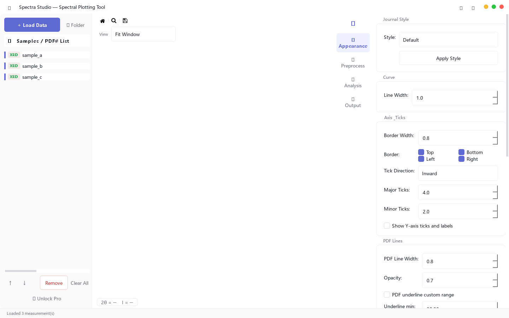
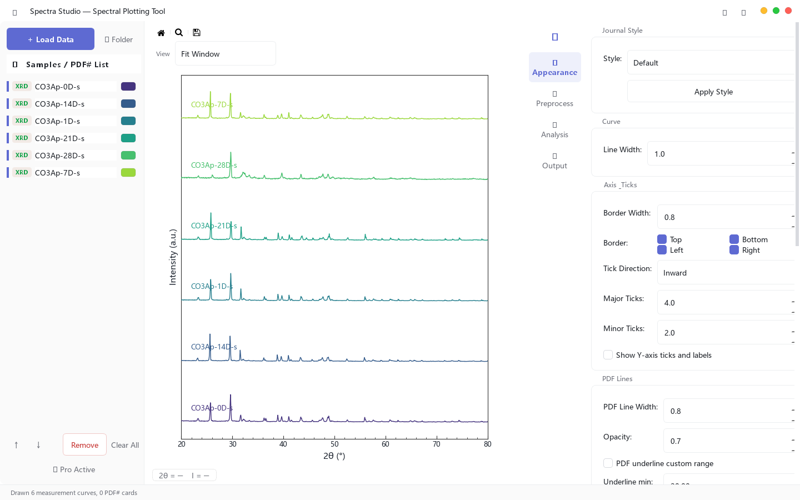
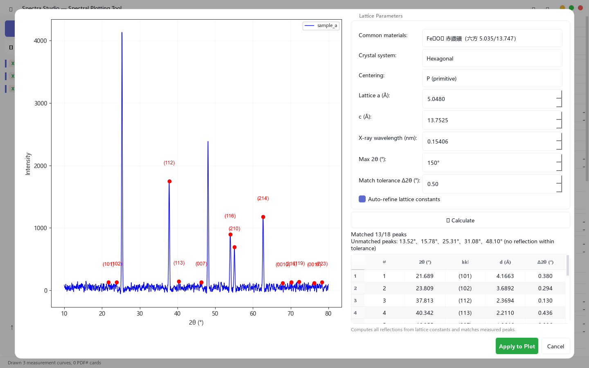
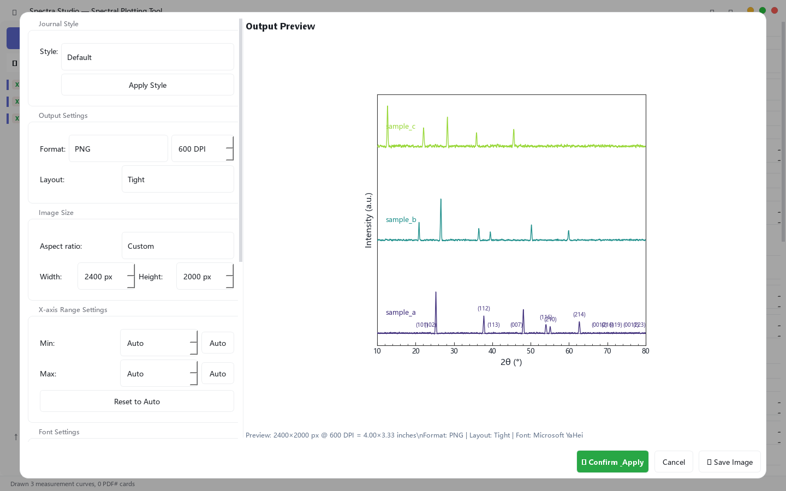

在材料、化學與物理實驗室裡，光譜數據的「畫圖」是一項每天都會遇到、卻很少被認真對待的工作。常見的解法是：用 Excel 畫（格式調整費時、輸出品質不穩定）、用昂貴的商業軟體（授權費動輒數千美元）、或自己寫 Python 腳本（每次都要重寫一遍）。Spectra Studio 針對這個需求設計：**免費、開機即用，目標是以一致的流程產出可重複的期刊級圖表。**

## 🎬 一分鐘看懂 Spectra Studio

<video controls preload="none" poster={`${import.meta.env.BASE_URL.replace(/\/$/, '')}/videos/spectra-studio-poster.jpg`} style={{ width: '100%', borderRadius: '12px', border: '1px solid var(--color-border)', background: '#000' }}>
  <source src={`${import.meta.env.BASE_URL.replace(/\/$/, '')}/videos/spectra-studio-demo.mp4`} type="video/mp4" />
  您的瀏覽器不支援影片播放，可直接<a href={`${import.meta.env.BASE_URL.replace(/\/$/, '')}/videos/spectra-studio-demo.mp4`}>下載影片</a>。
</video>

## 快速開始：免費版就有這些功能

下載安裝的這一份程式，就是完整版——**免費版功能全部立即可用**；Pro 功能也已經內建在同一個安裝檔裡，購買金鑰後立即解鎖，不需要重新下載任何東西。

免費版（$0，無限期、無浮水印）包含：

- **數據載入**：XRD（.txt / .xy / .csv / .dat）、FTIR（.asc）、RAMAN、DSC/TGA（Excel .xlsx / .xls）
- **多筆數據管理**：同時顯示、堆疊、歸一化、垂直偏移、批次上色
- **預處理**：Savitzky-Golay 平滑、ALS 基線校正
- **峰值分析**：自動尋峰
- **期刊繪圖樣式**：Nature / ACS / Elsevier 一鍵切換、圖例與刻度細調
- **匯出**：PNG / JPG（最高 300 DPI），無浮水印，可自由用於論文與報告

## 一步一步：10 分鐘做一張論文圖

下面以「三組 XRD 樣品 → ACS 期刊樣式投稿圖」為例，走完整個流程。

### 第 1 步：載入數據

點「載入數據」選擇檔案（或直接拖曳進視窗）。支援一次載入多個檔案，左側樣品清單會依序出現，曲線立即繪出；「堆疊」「歸一化」「垂直偏移」等選項讓多筆數據一目了然。

### 第 2 步：預處理（平滑＋基線）

在「預處理」面板調整平滑視窗（Savitzky-Golay）與基線參數（ALS），**所有修改即時預覽**，不用等。常見做法：平滑視窗 9–15 消除雜訊，再用基線校正把背景拉平。

### 第 3 步：自動尋峰

點「自動尋峰」，工具會依峰高與形狀自動標出候選峰（可調整敏感度）。找到的峰會顯示在峰位表，可直接在圖上檢查標註位置。

### 第 4 步：分峰擬合（Pro）

如果峰有重疊，用「分峰擬合」拆解：工具以尋峰結果為初始值，自動擬合 Gaussian / Lorentzian（或混合）峰型，輸出每個峰的**位置、半高寬（FWHM）、面積、R² 與殘差**，結果表可直接貼進補充材料。

### 第 5 步：套用期刊樣式

切換 Nature / ACS / Elsevier 樣式，圖例位置、字型、線寬、刻度方向等細項都能再微調；Pro 版還可開啟 Miller 指數標註與相位比對結果。

### 第 6 步：匯出

匯出前可先預覽，選擇格式與解析度。PNG / JPG 最高 300 DPI；Pro 版支援 PDF / SVG / EPS / TIFF 向量格式與更高解析度，投稿用的圖直接從這裡出去。

## 功能細節

### 支援的數據格式

| 儀器/類型 | 格式 | 說明 |
|---|---|---|
| XRD 粉末繞射 | .txt / .xy / .csv / .dat | 依內容自動偵測 2θ–強度欄位 |
| FTIR | .asc | 自動修正波數軸方向 |
| RAMAN | .txt / .xy / .csv | 與 XRD 相同載入流程 |
| DSC / TGA | .xlsx / .xls | Excel 工作表直接讀取 |
| PDF# 標準卡 | 內建格式 | 相位比對用（Pro） |

### 峰值分析

- **自動尋峰**：基於峰高/形狀的偵測器，敏感度可調
- **分峰擬合（Pro）**：Gaussian / Lorentzian / 混合峰型；自動初始值（從尋峰結果帶入）；輸出位置、FWHM、面積、R²、殘差；結果表可匯出
- **微積分（Pro）**：一階微分（找轉折/相變點）與積分（算面積/結晶度）

### 相位比對（Pro）

樣品峰位對 PDF 標準卡做比對，自動在峰上標註對應物相與 Miller 指數（(hkl)），支援誤差容忍度設定。判斷「這是 α 相還是 β 相」幾秒鐘就有答案。

### 期刊繪圖樣式

| 樣式 | 特色 |
|---|---|
| Nature | 無框線、極簡、字型小 |
| ACS | 左/下軸線、粗線、圖內圖例 |
| Elsevier | 四邊框線、經典學術排版 |

所有樣式皆可再調整：字型、字級、線寬、刻度方向與長度、圖例位置、軸範圍、標題。

### 匯出格式

| 格式 | 免費版 | Pro 版 |
|---|---|---|
| PNG / JPG | ✅（≤300 DPI） | ✅（最高 600 DPI） |
| PDF / SVG / EPS | — | ✅（向量，投稿首選） |
| TIFF | — | ✅（含 300/600 DPI 預設） |

## 免費版與 Pro 版

Spectra Studio 只有兩種版本：**免費版**與 **Pro 版**。免費版就是完整的日常工具，不會限時、不會浮水印；Pro 版補上進階分析與向量輸出。

| | 免費版 | Pro 版 |
|---|---|---|
| 價格 | $0（永久） | $79（一次買斷） |
| 數據載入與多筆管理 | ✅ | ✅ |
| 平滑、基線校正、自動尋峰 | ✅ | ✅ |
| 期刊樣式與 PNG/JPG 匯出（≤300 DPI） | ✅ | ✅ |
| 分峰擬合（含 R² 與殘差） | — | ✅ |
| 相位比對（PDF 卡片）與 Miller 指數 | — | ✅ |
| 微分 / 積分運算 | — | ✅ |
| 向量匯出（PDF / SVG / EPS / TIFF）與高 DPI | — | ✅ |

**Pro 版已經完成**：所有 Pro 功能都已開發完畢並內建在 v2.0.1 安裝檔中，不需要另外下載。購買 Pro 金鑰後，在程式內「🔑 解鎖 Pro」貼上金鑰即可立即啟用（需連網驗證一次，之後離線使用）。

[🛒 在 Gumroad 購買 Pro（$79 一次買斷）](https://jerryhome6.gumroad.com/l/rvymku)

- **一次買斷**，永久授權（包含目前 major 版本的更新）
- **30 天退款保證**
- 購買後 Gumroad 會寄送一組金鑰（`XXXX-XXXX-...` 格式）；換機、重灌只要再次貼入金鑰即可

## 安裝與下載

**系統需求**：Windows 10 以上（64 位元），免安裝 Python 或任何依賴套件。

兩種安裝方式（內容完全相同，都是含 Pro 功能的完整版）：

1. **安裝程式**（推薦）：[下載 SpectraStudio-Setup-v2.0.1.exe（120 MB）](https://github.com/hujerry96/Web/releases/latest/download/SpectraStudio-Setup-v2.0.1.exe)，雙擊執行，安裝至目前使用者目錄（不需管理員權限），並提供開始功能表捷徑與解除安裝程式。
2. **免安裝版**：[下載 SpectraStudio-v2.0.1-portable.exe（120 MB）](https://github.com/hujerry96/Web/releases/latest/download/SpectraStudio-v2.0.1-portable.exe)，雙擊即可執行。

> ⚠️ **SmartScreen 說明**：軟體目前尚未購買程式碼簽章憑證，Windows 可能顯示「Windows 已保護您的電腦」警告。點擊「更多資訊」→「仍要執行」即可繼續。我們會在累積足夠收入後盡快補上簽章。

**SHA-256 檢查碼**（下載後可自行驗證檔案完整性）：

- 安裝程式 `SpectraStudio-Setup-v2.0.1.exe`：`52bc24caa78ccf7cbe21ccb312b397a8a2f3d5742b59f5e33ab79344751956a9`
- 免安裝版 `SpectraStudio-v2.0.1-portable.exe`：`6720460eac64c8c9d993c29c51681d19e605d41fa9c158ee79bbc2ee2f4aca41`

更新方式：軟體啟動時會自動檢查新版本（僅提示，不強制）。

## 隱私

所有數據都在您自己的電腦上處理，**不會上傳任何數據檔案**。授權驗證採離線方式，啟動時僅檢查版本編號。詳見[隱私權政策](/privacy.md)。

## 常見問題

**Q：支援 Mac 或 Linux 嗎？**
目前僅提供 Windows 版；macOS 版已在規劃中。

**Q：免費版可以拿來做論文數據嗎？**
可以。免費版涵蓋日常出圖需求，輸出無浮水印，可自由用於論文與報告。

**Q：Pro 版買了之後怎麼啟用？**
在 [Gumroad](https://jerryhome6.gumroad.com/l/rvymku) 購買後，收據郵件會附上一組金鑰（`XXXX-XXXX-...` 格式）。在程式左側欄點「🔑 解鎖 Pro」，貼上金鑰即可立即啟用（首次需連網驗證，之後離線使用），不需重新安裝。

**Q：分峰擬合的結果可以匯出嗎？**
可以。Pro 版擬合結果包含每個峰的參數表與殘差，可直接用於補充材料。

**Q：買了 Pro 版，換電腦怎麼辦？**
授權採離線綁定，換機時提供本機代碼即可補發金鑰（請保留購買證明）。

**Q：儀器軟體匯出的數據可以直接用嗎？**
可以。工具依副檔名與內容自動偵測格式與欄位，多數儀器（Bruker、PANalytical、Rigaku 等）的 .txt/.csv/.xy 匯出都能直接載入。

**Q：一組數據可以輸出不同樣式嗎？**
可以。樣式切換即時生效，同一組數據想輸出 Nature 版與 ACS 版，切換後各存一份即可。
