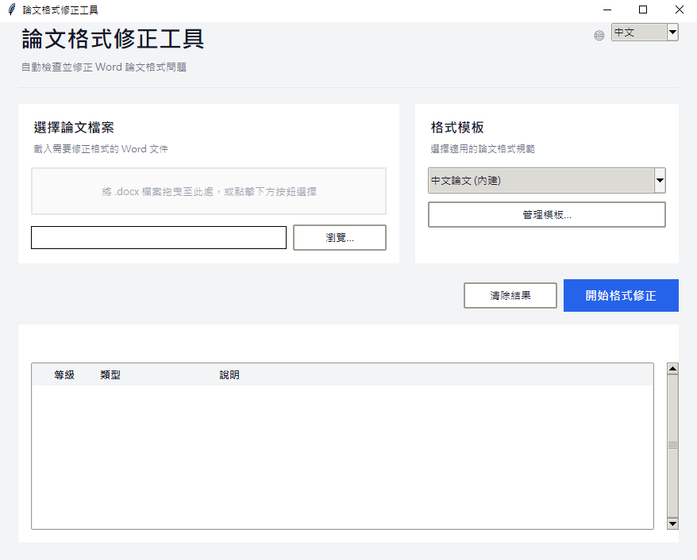
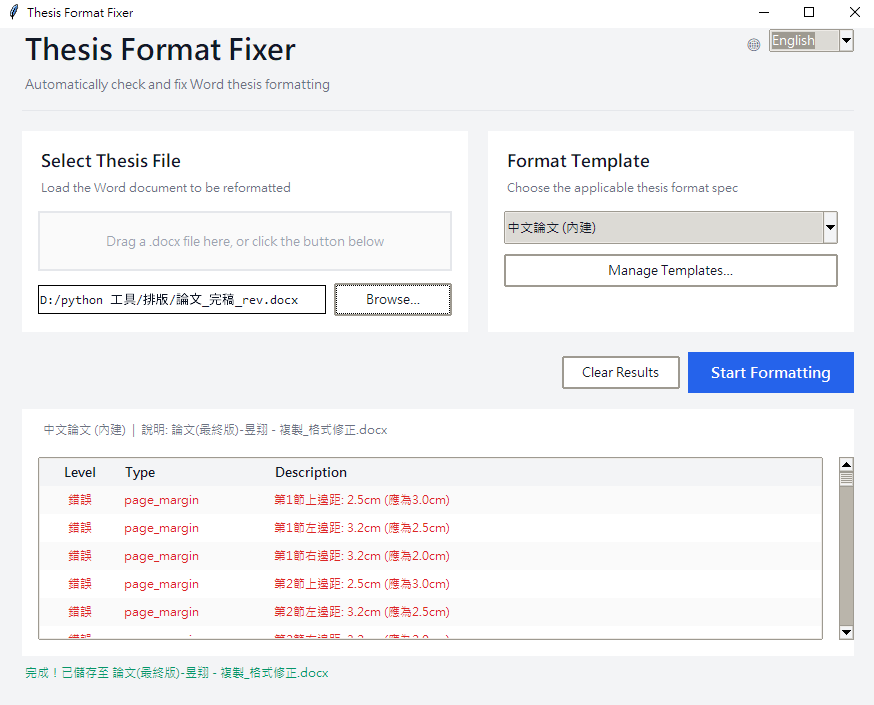
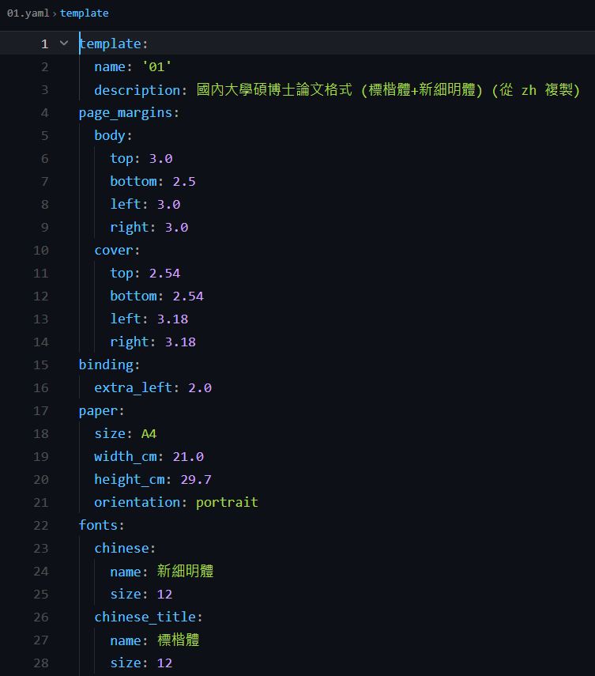

在碩博士論文的產出過程中，格式符合規範往往是一項繁重且易於出錯的環節。各校撰寫規範通常篇幅冗長，要求繁複：前頁採羅馬數字頁碼、本文採阿拉伯數字；圖表編號須為「圖 1.1」而非「圖1-1」；標題階層、首行縮排、行距、參考文獻交叉參照等，任一項不符即可能遭退件。本篇介紹的論文格式修正工具，即針對此一重複性高、規則明確的工作，提供自動化的解決方案。



## 工具功能概述

工具讀入一份 Word 文件（.docx），先進行一次全面掃描，列出所有不符合規範的格式問題，再經單次執行將其修正，並另存為新檔。整體流程為規則驅動，規則書寫於 YAML 檔中，使用者可自行調整。

支援範圍涵蓋：版面（邊距、裝訂邊、紙張大小）、字型（標題樣式、中英文字型統一）、間距（1.5 倍行距、段距、首行縮排）、頁碼（前頁羅馬、本文阿拉伯、起始頁碼）、目錄樣式、標題階層與分頁、圖表編號與置中、參考文獻交叉參照，以及封面間距。

## 所解決的問題

以人工方式調整格式存在三項常見限制。其一為繁瑣：篇幅達數百頁的論文，僅圖表編號的重編即耗費可觀時間。其二為遺漏：修正標題縮排後，可能忽略某張圖仍沿用舊有編號格式。其三為難以重來：當指導教授或口試委員調整要求，便須從頭再次檢核全文。

工具將「檢查與修正」整合為單次操作。它先掃描並列出清單供確認，再批次修正，過程透明且可重現，使用者無須逐頁翻查格式錯誤所在。


## 適用場景

- 碩博士論文送印前的最後檢核：一次性清除常見格式錯誤。
- 指導教授或口委要求變更後，快速重整整份文件。
- 實驗室內部共用同一份格式規則，使產出論文的格式保持一致。
- 協助將格式紊亂的文件回復至可用狀態，無須從頭重排。

## 安裝與準備

執行環境需 Python 3.8 以上。依賴套件安裝指令如下：

```bash
pip install -r requirements.txt
```

requirements 中包含 python-docx、lxml、PyYAML；圖形介面所用的 tkinter 為 Python 內建模組，一般無須額外安裝。

## 圖形介面：拖檔即執行

最簡便的使用方式為啟動圖形介面：

```bash
python main.py
```

將 Word 檔拖入視窗，或點選「選擇檔案」。工具會先執行分析，於畫面列出可修正項目，勾選欲修正者後執行，即另存一份 `_fixed.docx`。

介面右上角可切換語言（中文 / English），該選擇會被記錄，下次啟動即為所選語言。



## 命令列：整合至腳本中使用

若欲將分析或修正流程嵌入自有作業，亦可透過程式直接呼叫：

```python
from core.analyzer import FormatAnalyzer
from core.fixer import FormatFixer

# 分析
analyzer = FormatAnalyzer('rules/thesis_zh.yaml')
issues = analyzer.analyze('thesis.docx')
for i in issues:
    print(f"[{i['type']}] {i['message']}")

# 修正
fixer = FormatFixer('rules/thesis_zh.yaml')
results = fixer.fix_document('thesis.docx', 'thesis_fixed.docx')
for r in results:
    print(f"[{r['type']}] {r['message']}")
```

`rules/thesis_zh.yaml` 為中文格式規則檔。邊距、字型、行距、編號格式等項目皆可直接於此 YAML 中調整，無須修改程式碼。

## 實際修正項目

以下為較常遭退件的項目：

- 頁碼：封面與摘要採羅馬數字，本文自第 1 頁起採阿拉伯數字，工具自動切換。
- 圖表編號：「圖 1-1」自動轉換為「圖 1.1」，並置中對齊。
- 標題階層：標題 1 至 3 的分頁與編號，「Chapter X」與「X.」兩種格式可互相轉換。
- 參考文獻：交叉參照的 REF 欄位與參考文獻清單整理。
- 封面與縮排：封面間距、關鍵字設定，以及全文件首行縮排的統一。

## 規則自行定義

工具隨附的 `rules/thesis_zh.yaml` 係針對常見中文碩博士規範所撰寫，但使用者可視需求修改。可調整項目包含：頁面邊距與裝訂邊、中英文字型與大小、行距倍率與段距、首行縮排值、標題階層設定、圖表編號格式、頁碼樣式（羅馬／阿拉伯）、封面偵測關鍵字。

換言之，不同校系的不同規範，僅須修改 YAML 即可套用，無須觸及 Python 程式碼。



## 效益與限制

工具的效益在於快速、可重現，且規則透明。使用者先檢視清單確認，再決定修正範圍，不會發生未經確認即變更內容的情況。其為開源、可離線執行，實驗室內部共用一份規則即能發揮實質效益。

在限制方面，工具係針對特定格式問題進行規則式修正。若原始文件結構嚴重紊亂，例如樣式整組毀損、手動格式與樣式混用、或異常嵌套過深，修正結果可能不盡完善。因此工具本身亦提醒使用者：修正前應備份原檔，並於修正後人工覆核輸出。

## 小結

本工具不協助撰寫論文內容，但能將最為耗神的重複性格式檢查，壓縮為「拖入檔案、檢視清單、執行修正」三個步驟。將節省下來的時間投入於內容的精進，方為其根本價值。原始碼與執行檔皆置於 GitHub，歡迎取用。
