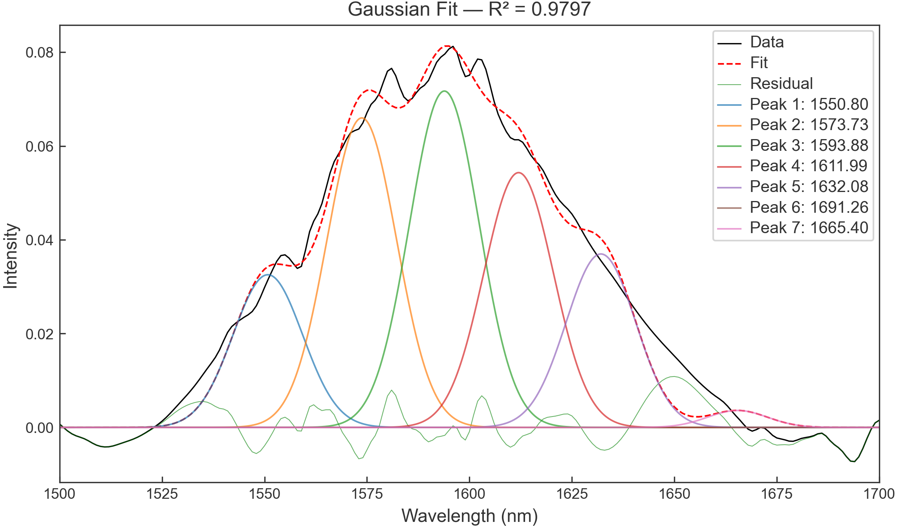

## Tauc plot 是什麼？為什麼 UV-Vis 可以估算 Band Gap？

在半導體、光觸媒、薄膜、鈣鈦礦與光電材料研究中，研究者常用 UV-Vis 吸收光譜估算光學能隙（optical band gap）。最常見的方法之一，就是建立 **Tauc plot**，再將吸收邊附近的線性區域外推到光子能量軸，得到 `Eg`。

Tauc 分析的重點不是只按下「畫一條直線」，而是要先確認材料適合直接躍遷（direct transition）或間接躍遷（indirect transition）的模型，並合理選擇線性區域。若模型或區域選錯，即使圖看起來很漂亮，Eg 也可能沒有可靠的物理意義。


## Tauc plot 的基本公式

常見形式為：

```text
(αhν)^n = A(hν − Eg)
```

其中：

- `α`：吸收係數
- `hν`：光子能量
- `Eg`：光學能隙
- `A`：比例常數
- `n`：依躍遷類型設定

實務上常見兩種選擇：

- **直接允許躍遷**：繪製 `(αhν)²` 對 `hν`
- **間接允許躍遷**：繪製 `(αhν)^(1/2)` 對 `hν`

在接近吸收邊的近似線性區域做線性擬合，將直線延伸至 y = 0，與 x 軸的交點就是估計的 `Eg`。若你不確定材料屬於哪一種躍遷，應依材料文獻、晶體結構與實驗條件進行判斷，不能只因某一種模型得到更接近預期的數字就直接採用。


## 從 UV-Vis 原始資料到 Tauc plot 的操作步驟

### Step 1：準備 wavelength 與 absorbance 資料

Spectra Studio 可載入 UV-Vis 的 `.txt`、`.xy` 與 `.csv` 檔案，並自動辨識以 nm 為單位的 wavelength 軸。支援的常見波長範圍約為 190–1200 nm。

如果儀器輸出的是 transmittance、reflectance 或其他格式，應先確認資料是否已轉成適合吸收分析的 absorbance，並在方法部分記錄轉換方式。不要直接把不同物理量混在同一個 Tauc 計算中。

### Step 2：開啟 Tauc Bandgap 分析

載入光譜後，點選 Tauc Bandgap。工具提供 direct 與 indirect 模式切換，會將 wavelength 轉換成 photon energy，建立相應的 Tauc plot，並在圖上標註估算出的 `Eg` 及對應波長。

### Step 3：選擇自動或手動線性區域

Spectra Studio 會先自動偵測適合的線性區域並繪製切線，方便快速得到初始結果。若自動區域沒有涵蓋你認為最合理的吸收邊，可切換到 manual mode，在圖上點選兩個位置：第一點為起點，第二點為終點，系統會即時重新計算。

自動結果的精度約為工具介面提供的初步估計，不應被視為所有材料與儀器條件下的絕對誤差保證。正式投稿前，建議檢查原始吸收光譜、基線、線性區間、擬合 R² 以及不同區域對 Eg 的敏感度。

### Step 4：有薄膜厚度時，設定吸收係數

如果你有薄膜厚度 `d`，Spectra Studio 可使用：

```text
α = 2.303A / d
```

將 absorbance `A` 與膜厚轉成吸收係數。厚度以 μm 輸入時，應確認後續單位與圖軸設定一致。

如果沒有膜厚，也可以使用相對吸收係數進行 Tauc 分析；在這種情況下，能隙交點的數值不受整體 α 比例常數影響，但資料品質、基線與線性區間仍會影響結果。

## Tauc plot 最常見的五個錯誤

### 1. 把吸收邊波長直接當成 Eg

波長與能量不是同一個量。Tauc 分析會先使用 `E = hc/λ` 轉成 photon energy，再進行線性外推。吸收邊波長可以提供直觀參考，但不應取代完整的 Tauc 分析。

### 2. 沒有說明 direct 或 indirect 模型

同一份 UV-Vis 資料使用不同的 n 值，可能得到不同的 Eg。論文中應明確交代選擇的躍遷模型與理由。

### 3. 把整段曲線都拿去做線性擬合

Tauc plot 的線性區域通常只在吸收邊附近。若把低能量尾端、雜訊區或高能量強吸收區全部納入，外推結果會被拉偏。

### 4. 忽略樣品厚度與資料前處理

對薄膜來說，厚度與基線會影響吸收係數；對粉末或散射嚴重樣品，吸收光譜也可能受到樣品製備與儀器幾何影響。應在方法與限制中說明。

### 5. 把自動結果當成不需要審查的答案

自動偵測適合加速重複工作，不代表可以跳過科學判讀。最終仍要確認線性區、相別、材料模型與文獻是否一致。



## 為什麼用 Spectra Studio 做 Tauc plot？

手動建立 Tauc plot 往往需要在 Excel 或 Origin 中重複處理 wavelength、photon energy、alpha、平方或平方根轉換、線性區選擇與圖上標註。如果使用 Python，還要維護資料清理、單位轉換與繪圖程式。

Spectra Studio Pro 把這些常見步驟集中在一個 Windows 介面：

- UV-Vis `.txt`、`.xy`、`.csv` 直接載入
- wavelength（nm）自動辨識
- direct `(αhν)²` 與 indirect `(αhν)^(1/2)` 一鍵切換
- 自動偵測線性區並繪製切線
- 可用兩點手動微調線性區
- `Eg` 與對應波長直接標在圖上
- 可選填薄膜厚度，計算吸收係數
- 與 XRD、FTIR、Raman 圖譜使用同一套 journal style 與輸出流程

需要 Tauc Bandgap 的使用者可以先下載同一個安裝程式，Free 版完成資料載入與基本圖譜整理；Pro key 則解鎖 Tauc、峰擬合、晶粒尺寸與向量輸出等進階功能。

## 常見問題

### Tauc plot 一定能得到材料真正的 band gap 嗎？

Tauc plot 得到的是根據吸收資料、躍遷模型與線性外推得到的光學能隙估計。它會受到樣品品質、散射、缺陷態、厚度、基線與線性區選擇影響，不應脫離實驗條件解讀。

### 沒有薄膜厚度可以做 Tauc plot 嗎？

可以使用相對吸收係數進行估算。整體比例常數不會改變理想線性外推的 x 軸交點，但仍要確認 absorbance 資料與前處理方式合理。

### Direct 與 indirect 要選哪一個？

依材料已知電子結構、文獻與研究目的選擇。若兩種模型都測試，應報告選擇標準，而不是只挑結果最好看的那一條線。

### 有沒有不用 Python 的 Tauc plot 軟體？

Spectra Studio Pro 可直接載入 UV-Vis 資料，切換 direct/indirect 模式，自動或手動選擇線性區並標註 Eg。

## 結語

Tauc plot 的價值在於把 UV-Vis 吸收邊轉成可比較的光學能隙估計，但可靠結果來自正確的資料、合理的躍遷模型與透明的線性區選擇。Spectra Studio 可以把 wavelength 轉換、Tauc 變換、線性區與圖上標註集中處理，讓你把時間留給材料判讀，而不是重複搬運欄位與公式。

👉 **用 Spectra Studio 整理 UV-Vis 與 Tauc band gap：**
[查看官方功能與下載方式](../spectra-studio-guide/)

