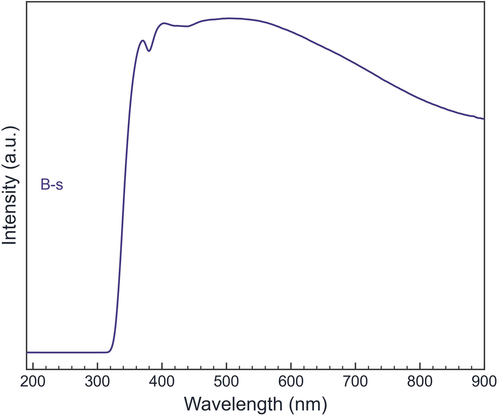

## 做一張 XRD 論文圖，為什麼常常比想像中花時間？

XRD 儀器通常可以很快產生繞射資料，但從原始檔案到能放進論文的圖，還要處理很多細節：檔案格式、背景、雜訊、樣品之間的垂直間距、圖例、字體、座標軸、峰標註與輸出解析度。

Origin 很強大，Python 也能做到高度客製化；但如果你的需求是把多組 XRD、FTIR、Raman 或 UV-Vis 資料快速整理成乾淨的投稿圖，未必需要先學習一整套繪圖環境。**Spectra Studio** 的定位，就是把材料實驗室最常用的資料處理與作圖流程集中在一個 Windows 桌面工具裡。

## Spectra Studio 適合哪些人？

這個工具特別適合以下情境：

- 研究生需要在投稿前快速整理多組 XRD 圖
- 實驗室電腦不方便安裝 Python 與套件
- 想找一個比通用繪圖軟體更專注於光譜與繞射資料的工具
- 需要疊圖、stack、normalize、vertical offset 與批次配色
- 想輸出無浮水印的 PNG/JPG，或在 Pro 版輸出 PDF/SVG/EPS/TIFF
- 希望資料在本機處理，不必建立雲端帳戶

Free 版不是只能試看的 demo：基本載入、預處理、峰偵測、期刊樣式與 PNG/JPG 輸出可以直接使用，沒有試用倒數，也不會在圖上加浮水印。

## 10 分鐘製作一張期刊風格 XRD 圖

以下以多組 XRD 樣品比較為例，示範從原始資料到輸出的實用流程。

### Step 1：一次載入多個 XRD 檔案

按下 Load data，或直接把檔案拖曳到視窗中。Spectra Studio 可以讀取 PANalytical 的 `.xrdml`、Bruker 的 `.brml`、`.uxd`，以及常見的 `.txt`、`.xy`、`.csv`、`.dat` 兩欄資料。

多個樣品載入後，左側會出現 sample list，右側即時顯示曲線。你可以選擇 overlay 來比較峰位，也可以使用 stack 或 vertical offset，讓不同樣品的峰形不會互相遮住。

### Step 2：先處理平滑與基線

如果原始資料的雜訊較多，可在 preprocessing 面板調整 Savitzky–Golay smoothing。若背景有明顯斜率或螢光背景，再使用 ALS baseline correction。

建議不要一開始就把曲線處理得過度平滑。期刊圖應該忠實呈現資料；平滑主要是幫助讀者看清楚趨勢與峰形，不是用來製造更漂亮的結果。Spectra Studio 的處理變更會即時預覽，方便你在保留細節與降低雜訊之間找到平衡。

### Step 3：用自動峰偵測加上峰標記

按下 Auto peak detection 後，工具會根據峰高與形狀找出候選峰，並把結果標註在圖上。Sensitivity 可以調整：訊號較弱時提高靈敏度，背景起伏較大時則降低靈敏度，再逐一檢查候選峰是否合理。

如果要做 Scherrer 晶粒尺寸、重疊峰分離或 Miller index 標註，這些峰偵測結果也能作為後續分析的起點。

### Step 4：套用 Nature、ACS 或 Elsevier 樣式

不用從零開始設定所有字體與座標軸。Spectra Studio 提供三種常見期刊風格：

- **Nature style**：無外框、簡潔、緊湊字體
- **ACS style**：左側與下方座標軸、較醒目的線條與圖內圖例
- **Elsevier style**：完整框線、傳統學術版面

套用樣式後，仍然可以調整字型、字級、線寬、tick direction、tick length、圖例位置、標題與座標範圍。這樣可以先維持一致的視覺基礎，再依照目標期刊的 author guidelines 微調。

### Step 5：選擇正確輸出格式與解析度

Free 版支援無浮水印的 PNG/JPG，解析度最高 300 DPI，足以應付許多報告與初稿需求。Pro 版則提供 PDF、SVG、EPS 與 TIFF，解析度可到 600 DPI，適合需要向量圖或期刊指定格式的情境。

如果圖中有細線、峰標籤或小字，向量格式通常比截圖更可靠。不要把螢幕截圖貼進 Word 後再放大，這很容易導致文字模糊與線條鋸齒。

## Free 與 Pro 怎麼選？

如果你只是需要快速載入資料、疊圖、平滑、基線校正、峰偵測與輸出 PNG/JPG，Free 版即可開始使用。

如果你的研究還需要以下功能，則可以在同一個安裝程式中解鎖 Pro：

- Gaussian、Lorentzian 與 mixed peak fitting
- 峰位置、FWHM、面積、R² 與 residuals
- Scherrer crystallite size
- Williamson–Hall plot 與 microstrain
- crystallinity 計算
- UV-Vis Tauc bandgap
- PDF reference card phase matching 與 Miller indices
- PDF/SVG/EPS/TIFF 向量輸出與較高解析度

Pro 是一次性授權，不是月租；同一個 key 可解鎖全部 Pro 功能。購買後不需要重新下載安裝程式，輸入 key 即可啟用。

## 和 Origin、Python 怎麼搭配？

Spectra Studio 不一定要取代 Origin 或 Python。它比較適合處理常見、重複性高的圖譜工作：先把原始檔案快速整理成乾淨的圖，完成初步峰分析與投稿版面，再把需要特殊模型或大規模統計的資料交給既有 Python pipeline。

如果你已經有成熟的 Origin 範本或 Python 腳本，仍然可以繼續使用；如果你只是想在沒有程式環境的 Windows 實驗室電腦上快速完成一張可讀、可調整、可輸出的 XRD 圖，Spectra Studio 可以少掉不少前置設定。

## 常見問題

### Spectra Studio 真的免費嗎？

Free 版可永久使用，沒有時間限制與浮水印。部分進階功能屬於 Pro，但基本 XRD 圖表流程可以先免費完成。

### 需要安裝 Python、Origin 或其他套件嗎？

不需要。Windows 安裝程式約 120 MB，工具本身不依賴 Python runtime 或額外套件。

### 免費版能輸出論文圖嗎？

可以輸出無浮水印的 PNG/JPG，最高 300 DPI。若目標期刊要求 PDF、SVG、EPS 或 TIFF，則需使用 Pro 的向量與高解析度輸出功能。

### 我的 XRD 資料會上傳到網路嗎？

Spectra Studio 的資料分析在本機執行；Free 版不需要帳戶，樣品與光譜不會為了分析而上傳到雲端。

### Mac 或 Linux 可以使用嗎？

目前主要支援 Windows 10/11 64-bit。若實驗室使用 Windows 儀器電腦，通常可以直接安裝；Mac/Linux 使用者則需要 Windows 虛擬機或其他相容環境。

## 結語：把時間留給材料問題，而不是圖表排版

論文圖的重點是清楚呈現材料差異與分析結果，而不是把每個晚上都花在手動調整線寬、圖例與樣品間距。從多檔載入、預處理、峰偵測到期刊樣式與高解析度輸出，Spectra Studio 將常見 XRD 作圖步驟放在同一個介面中，讓你不用先學會 Origin 或建立 Python 環境，也能快速完成第一版投稿圖。

👉 **免費下載並開始製作 XRD 論文圖：**
[前往 Spectra Studio 官方功能介紹](../spectra-studio-guide/)

